# Perancangan Sistem & Diagram UML Per Fitur
**Sistem Informasi Pemesanan Catering Nasi Uduk Berbasis Web Menggunakan Framework Laravel**  
*Studi Kasus: Usaha Catering Nasi Uduk (Porsi Satuan, Nasi Box, dan Paket Prasmanan/Catering)*

Dokumen ini memuat perancangan sistem visual lengkap yang disusun **secara modular per fitur** untuk kebutuhan implementasi teknis dan lampiran akademik (Skripsi/Tugas Akhir). Seluruh diagram dirancang dengan standar **Monokrom / Hitam Putih (Black & White)** agar siap cetak dokumen resmi tanpa distorsi warna. Setiap fitur dilengkapi dengan:
1. **Activity Diagram** (PlantUML 3 Swimlane: *Aktor*, *Sistem (Web Laravel)*, *Database (MySQL)*)
2. **Sequence Diagram** (Mermaid 3 Partisipan: *Aktor*, *Sistem*, *Database*)
3. **Flowchart** (Mermaid Logika Bisnis)

---

## Daftar Isi
1. [Use Case Diagram Global (PlantUML)](#1-use-case-diagram-global-plantuml)
2. [Class Diagram Global (Mermaid)](#2-class-diagram-global-mermaid)
3. [Fitur 1: Autentikasi Pengguna & Registrasi Multi-Peran](#3-fitur-1-autentikasi-pengguna--registrasi-multi-peran)
4. [Fitur 2: Katalog Menu & Paket Catering Nasi Uduk](#4-fitur-2-katalog-menu--paket-catering-nasi-uduk)
5. [Fitur 3: Manajemen Keranjang Pesanan (Cart Management)](#5-fitur-3-manajemen-keranjang-pesanan-cart-management)
6. [Fitur 4: Checkout, Penjadwalan & Form Pengiriman](#6-fitur-4-checkout-penjadwalan--form-pengiriman)
7. [Fitur 5: Pembayaran & Unggah Bukti Transfer Bank](#7-fitur-5-pembayaran--unggah-bukti-transfer-bank)
8. [Fitur 6: Riwayat Transaksi & Pelacakan Status Pesanan](#8-fitur-6-riwayat-transaksi--pelacakan-status-pesanan)
9. [Fitur 7: Dashboard Ringkasan & Metrik Bisnis Admin](#9-fitur-7-dashboard-ringkasan--metrik-bisnis-admin)
10. [Fitur 8: Pengelolaan Master Data Menu & Paket (CRUD Menu)](#10-fitur-8-pengelolaan-master-data-menu--paket-crud-menu)
11. [Fitur 9: Manajemen Pesanan & Verifikasi Pembayaran Admin](#11-fitur-9-manajemen-pesanan--verifikasi-pembayaran-admin)
12. [Fitur 10: Pengelolaan Data Pelanggan Terdaftar](#12-fitur-10-pengelolaan-data-pelanggan-terdaftar)
13. [Fitur 11: Laporan Penjualan & Ekspor Laporan (PDF & Excel)](#13-fitur-11-laporan-penjualan--ekspor-laporan-pdf--excel)
14. [Matriks Keterlacakan UML Antar-Fitur](#14-matriks-keterlacakan-uml-antar-fitur)

---

## 1. Use Case Diagram Global (PlantUML)

Use Case Diagram menggambarkan fungsi utama sistem yang memisahkan interaksi antara aktor **Pelanggan (Customer)** dan **Admin**, dilengkapi hubungan ketergantungan **`<<include>>`** (eksekusi wajib) dan **`<<extend>>`** (fitur perluasan kondisional/opsional).

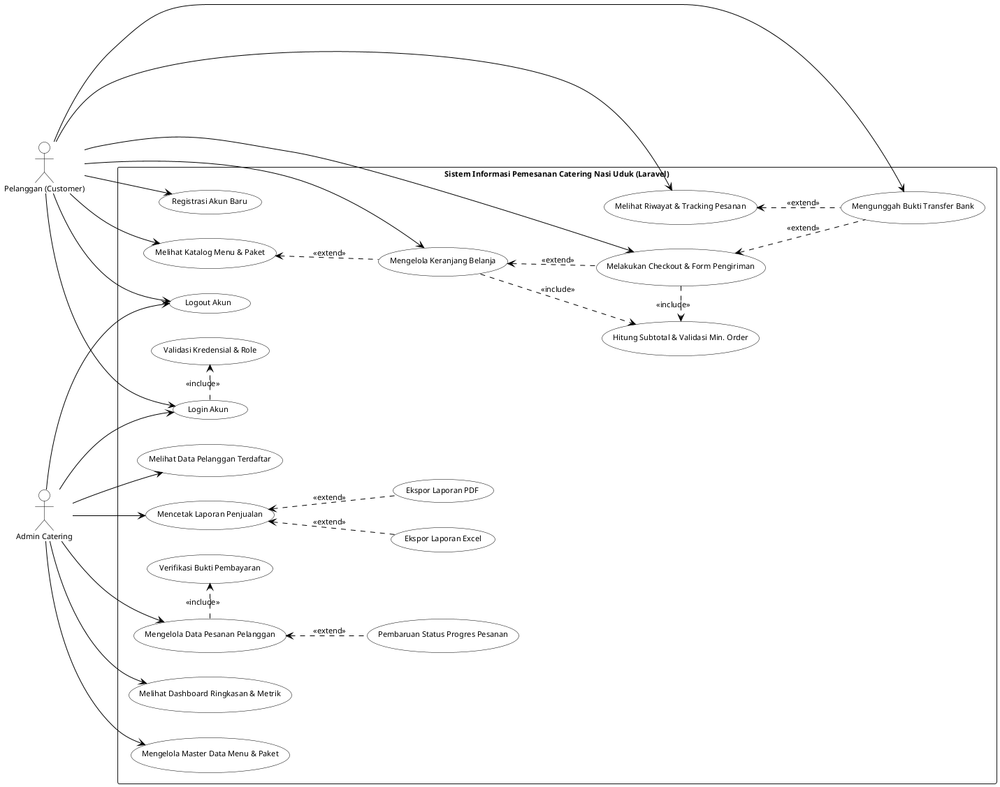
```plantuml
@startuml UseCase_Global_Catering
skinparam monochrome true
skinparam packageStyle rectangle
skinparam shadowing false
skinparam defaultFontName Arial
skinparam defaultFontSize 11
skinparam roundcorner 5
skinparam ArrowColor #000000
skinparam ActorBorderColor #000000
skinparam ActorBackgroundColor #FFFFFF
skinparam UsecaseBorderColor #000000
skinparam UsecaseBackgroundColor #FFFFFF

left to right direction

actor "Pelanggan (Customer)" as Pelanggan
actor "Admin Catering" as Admin

rectangle "Sistem Informasi Pemesanan Catering Nasi Uduk (Laravel)" {

    ' Modul Autentikasi
    usecase "Registrasi Akun Baru" as UC_Register
    usecase "Login Akun" as UC_Login
    usecase "Validasi Kredensial & Role" as UC_ValAuth
    usecase "Logout Akun" as UC_Logout

    ' Modul Pelanggan
    usecase "Melihat Katalog Menu & Paket" as UC_Catalog
    usecase "Mengelola Keranjang Belanja" as UC_Cart
    usecase "Melakukan Checkout & Form Pengiriman" as UC_Checkout
    usecase "Hitung Subtotal & Validasi Min. Order" as UC_ValCart
    usecase "Mengunggah Bukti Transfer Bank" as UC_UploadPayment
    usecase "Melihat Riwayat & Tracking Pesanan" as UC_TrackOrder

    ' Modul Admin
    usecase "Melihat Dashboard Ringkasan & Metrik" as UC_AdminDashboard
    usecase "Mengelola Master Data Menu & Paket" as UC_ManageMenu
    usecase "Mengelola Data Pesanan Pelanggan" as UC_ManageOrder
    usecase "Verifikasi Bukti Pembayaran" as UC_VerifyPayment
    usecase "Pembaruan Status Progres Pesanan" as UC_UpdateStatus
    usecase "Melihat Data Pelanggan Terdaftar" as UC_ManageCustomer
    usecase "Mencetak Laporan Penjualan" as UC_SalesReport
    usecase "Ekspor Laporan PDF" as UC_ExportPDF
    usecase "Ekspor Laporan Excel" as UC_ExportExcel
}

' Relasi Aktor Pelanggan
Pelanggan --> UC_Register
Pelanggan --> UC_Login
Pelanggan --> UC_Logout
Pelanggan --> UC_Catalog
Pelanggan --> UC_Cart
Pelanggan --> UC_Checkout
Pelanggan --> UC_UploadPayment
Pelanggan --> UC_TrackOrder

' Relasi Aktor Admin
Admin --> UC_Login
Admin --> UC_Logout
Admin --> UC_AdminDashboard
Admin --> UC_ManageMenu
Admin --> UC_ManageOrder
Admin --> UC_ManageCustomer
Admin --> UC_SalesReport

' Hubungan <<include>> (Wajib Dijalankan)
UC_Login .> UC_ValAuth : <<include>>
UC_Cart .> UC_ValCart : <<include>>
UC_Checkout .> UC_ValCart : <<include>>
UC_ManageOrder .> UC_VerifyPayment : <<include>>

' Hubungan <<extend>> (Opsional / Perluasan Perilaku)
UC_Catalog <.. UC_Cart : <<extend>>
UC_Cart <.. UC_Checkout : <<extend>>
UC_Checkout <.. UC_UploadPayment : <<extend>>
UC_TrackOrder <.. UC_UploadPayment : <<extend>>
UC_ManageOrder <.. UC_UpdateStatus : <<extend>>
UC_SalesReport <.. UC_ExportPDF : <<extend>>
UC_SalesReport <.. UC_ExportExcel : <<extend>>

@enduml
```

### Penjelasan Relasi `<<include>>` dan `<<extend>>` untuk Penguji / Non-IT:
* **Relasi `<<include>>` (Proses Inti Wajib):**
  1. *Login Akun* $\xrightarrow{<<include>>}$ *Validasi Kredensial & Role*: Sistem secara wajib mengecek username/email, kecocokan hash password, dan status aktif akun pengguna.
  2. *Mengelola Keranjang & Checkout* $\xrightarrow{<<include>>}$ *Hitung Subtotal & Validasi Min. Order*: Setiap kali item ditambahkan atau di-checkout, sistem wajib menghitung total biaya serta memvalidasi apakah kuantitas telah memenuhi batas minimal pesanan (khusus paket catering/box).
  3. *Mengelola Data Pesanan* $\xrightarrow{<<include>>}$ *Verifikasi Bukti Pembayaran*: Dalam memproses pesanan masuk, admin wajib memeriksa dan memvalidasi keabsahan struk transfer pelanggan sebelum order diproses memasak.
* **Relasi `<<extend>>` (Proses Opsional / Perluasan Fitur):**
  1. *Melihat Katalog* $\xleftarrow{<<extend>>}$ *Mengelola Keranjang*: Pelanggan yang sedang melihat katalog dapat memperluas tindakan dengan menambahkan menu ke keranjang belanja.
  2. *Checkout & Tracking Pesanan* $\xleftarrow{<<extend>>}$ *Unggah Bukti Transfer*: Setelah checkout atau saat memeriksa status pesanan di halaman riwayat, pelanggan dapat memilih untuk mengunggah berkas foto struk pembayaran.
  3. *Mengelola Pesanan* $\xleftarrow{<<extend>>}$ *Pembaruan Status Progres*: Admin secara opsional memperbarui tahapan pesanan (Diproses $\rightarrow$ Dikirim/Siap Ambil $\rightarrow$ Selesai) sesuai progres dapur.
  4. *Laporan Penjualan* $\xleftarrow{<<extend>>}$ *Ekspor PDF & Excel*: Admin dapat menyaring laporan di web dan secara opsional mencetak berkas PDF atau mengunduh tabel Excel.

---

## 2. Class Diagram Global (Mermaid)

Class diagram memetakan entitas data relasional dalam arsitektur basis data MySQL dengan Model Eloquent Laravel.

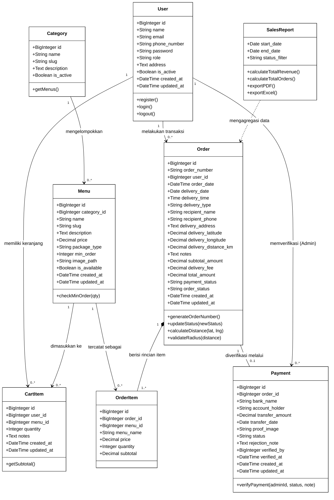
```mermaid
%%{init: {'theme': 'base', 'themeVariables': {'primaryColor': '#ffffff', 'primaryTextColor': '#000000', 'primaryBorderColor': '#000000', 'lineColor': '#000000', 'classText': '#000000'}}}%%
classDiagram
    class User {
        +BigInteger id
        +String name
        +String email
        +String phone_number
        +String password
        +String role
        +Text address
        +Boolean is_active
        +DateTime created_at
        +DateTime updated_at
        +register()
        +login()
        +logout()
    }

    class Category {
        +BigInteger id
        +String name
        +String slug
        +Text description
        +Boolean is_active
        +getMenus()
    }

    class Menu {
        +BigInteger id
        +BigInteger category_id
        +String name
        +String slug
        +Text description
        +Decimal price
        +String package_type
        +Integer min_order
        +String image_path
        +Boolean is_available
        +DateTime created_at
        +DateTime updated_at
        +checkMinOrder(qty)
    }

    class CartItem {
        +BigInteger id
        +BigInteger user_id
        +BigInteger menu_id
        +Integer quantity
        +Text notes
        +DateTime created_at
        +DateTime updated_at
        +getSubtotal()
    }

    class Order {
        +BigInteger id
        +String order_number
        +BigInteger user_id
        +DateTime order_date
        +Date delivery_date
        +Time delivery_time
        +String delivery_type
        +String recipient_name
        +String recipient_phone
        +Text delivery_address
        +Decimal delivery_latitude
        +Decimal delivery_longitude
        +Decimal delivery_distance_km
        +Text notes
        +Decimal subtotal_amount
        +Decimal delivery_fee
        +Decimal total_amount
        +String payment_status
        +String order_status
        +DateTime created_at
        +DateTime updated_at
        +generateOrderNumber()
        +updateStatus(newStatus)
        +calculateDistance(lat, lng)
        +validateRadius(distance)
    }

    class OrderItem {
        +BigInteger id
        +BigInteger order_id
        +BigInteger menu_id
        +String menu_name
        +Decimal price
        +Integer quantity
        +Decimal subtotal
    }

    class Payment {
        +BigInteger id
        +BigInteger order_id
        +String bank_name
        +String account_holder
        +Decimal transfer_amount
        +Date transfer_date
        +String proof_image
        +String status
        +Text rejection_note
        +BigInteger verified_by
        +DateTime verified_at
        +DateTime created_at
        +DateTime updated_at
        +verifyPayment(adminId, status, note)
    }

    class SalesReport {
        +Date start_date
        +Date end_date
        +String status_filter
        +calculateTotalRevenue()
        +calculateTotalOrders()
        +exportPDF()
        +exportExcel()
    }

    User "1" --> "0..*" CartItem : memiliki keranjang
    User "1" --> "0..*" Order : melakukan transaksi
    Category "1" --> "0..*" Menu : mengelompokkan
    Menu "1" --> "0..*" CartItem : dimasukkan ke
    Menu "1" --> "0..*" OrderItem : tercatat sebagai
    Order "1" *-- "1..*" OrderItem : berisi rincian item
    Order "1" -- "0..1" Payment : diverifikasi melalui
    User "1" --> "0..*" Payment : memverifikasi (Admin)
    SalesReport ..> Order : mengagregasi data
```

---

## 3. Fitur 1: Autentikasi Pengguna & Registrasi Multi-Peran

Fitur ini mengelola dua proses utama: **Pendaftaran Akun Pelanggan Baru (Registrasi)** dan **Autentikasi Hak Akses (Login & Role-Based Redirect)**. Agar alur diagram tidak bertabrakan atau rumit (*anti-spaghetti*), kedua sub-proses disajikan dalam diagram terpisah yang linear, terstruktur, dan mudah dipahami penguji.

---

### 3.1 Sub-Alur A: Registrasi Akun Pelanggan Baru

#### A. Activity Diagram Registrasi (PlantUML - 3 Swimlane)
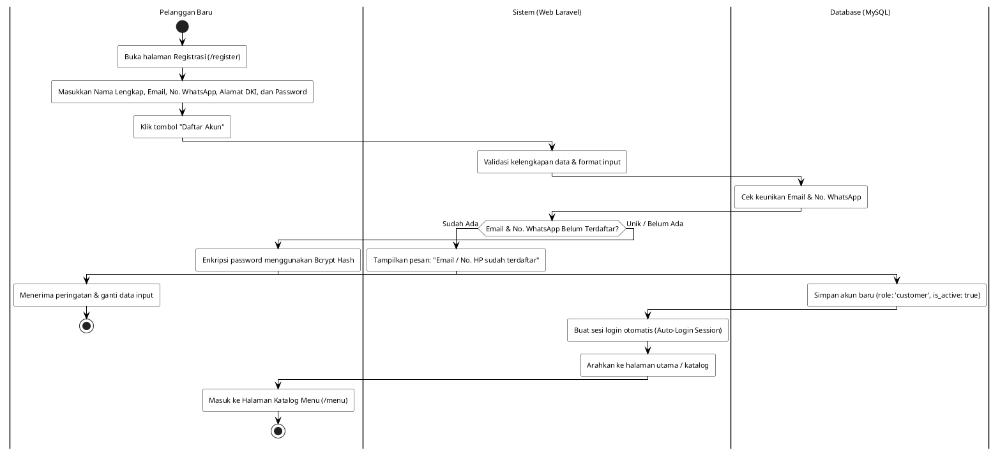
```plantuml
@startuml Activity_Fitur1_Registrasi
skinparam monochrome true
skinparam packageStyle rectangle
skinparam shadowing false
skinparam defaultFontName Arial
skinparam defaultFontSize 11
skinparam roundcorner 4
skinparam ArrowColor #000000
skinparam ActivityBorderColor #000000
skinparam ActivityBackgroundColor #FFFFFF
skinparam ActivityDiamondBorderColor #000000
skinparam ActivityDiamondBackgroundColor #FFFFFF

|Pelanggan Baru|
|Sistem (Web Laravel)|
|Database (MySQL)|

|Pelanggan Baru|
start
:Buka halaman Registrasi (/register);
:Masukkan Nama Lengkap, Email, No. WhatsApp, Alamat DKI, dan Password;
:Klik tombol "Daftar Akun";

|Sistem (Web Laravel)|
:Validasi kelengkapan data & format input;

|Database (MySQL)|
:Cek keunikan Email & No. WhatsApp;

|Sistem (Web Laravel)|
if (Email & No. WhatsApp Belum Terdaftar?) then (Sudah Ada)
  :Tampilkan pesan: "Email / No. HP sudah terdaftar";
  |Pelanggan Baru|
  :Menerima peringatan & ganti data input;
  stop
else (Unik / Belum Ada)
  :Enkripsi password menggunakan Bcrypt Hash;
  |Database (MySQL)|
  :Simpan akun baru (role: 'customer', is_active: true);
  |Sistem (Web Laravel)|
  :Buat sesi login otomatis (Auto-Login Session);
  :Arahkan ke halaman utama / katalog;
  |Pelanggan Baru|
  :Masuk ke Halaman Katalog Menu (/menu);
  stop
endif
@enduml
```

#### B. Sequence Diagram Registrasi (Mermaid - 3 Partisipan)
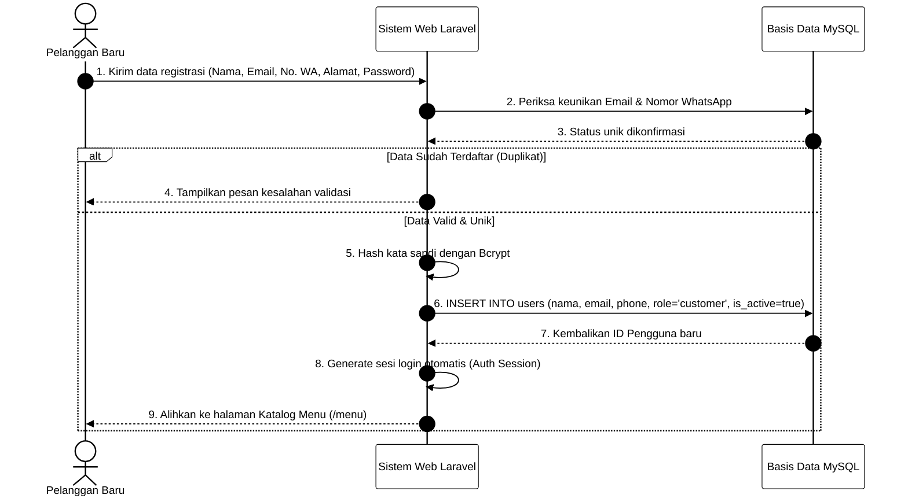
```mermaid
%%{init: {'theme': 'base', 'themeVariables': {'primaryColor': '#ffffff', 'primaryTextColor': '#000000', 'primaryBorderColor': '#000000', 'lineColor': '#000000', 'secondaryColor': '#ffffff', 'tertiaryColor': '#ffffff', 'actorBkg': '#ffffff', 'actorBorder': '#000000', 'actorTextColor': '#000000', 'actorLineColor': '#000000', 'signalColor': '#000000', 'signalTextColor': '#000000', 'labelBoxBkgColor': '#ffffff', 'labelBoxBorderColor': '#000000', 'labelTextColor': '#000000', 'loopTextColor': '#000000', 'noteBorderColor': '#000000', 'noteBkgColor': '#ffffff', 'noteTextColor': '#000000', 'activationBorderColor': '#000000', 'activationBkgColor': '#f4f4f4', 'sequenceNumberColor': '#000000'}}}%%
sequenceDiagram
    autonumber
    actor Cust as Pelanggan Baru
    participant Web as Sistem Web Laravel
    participant DB as Basis Data MySQL

    Cust->>Web: 1. Kirim data registrasi (Nama, Email, No. WA, Alamat, Password)
    Web->>DB: 2. Periksa keunikan Email & Nomor WhatsApp
    DB-->>Web: 3. Status unik dikonfirmasi
    
    alt Data Sudah Terdaftar (Duplikat)
        Web-->>Cust: 4. Tampilkan pesan kesalahan validasi
    else Data Valid & Unik
        Web->>Web: 5. Hash kata sandi dengan Bcrypt
        Web->>DB: 6. INSERT INTO users (nama, email, phone, role='customer', is_active=true)
        DB-->>Web: 7. Kembalikan ID Pengguna baru
        Web->>Web: 8. Generate sesi login otomatis (Auth Session)
        Web-->>Cust: 9. Alihkan ke halaman Katalog Menu (/menu)
    end
```

#### C. Flowchart Registrasi Pelanggan Baru (Mermaid)
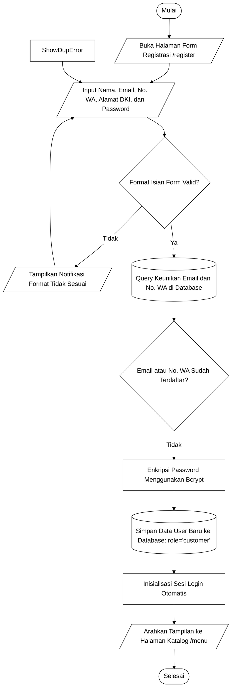
```mermaid
%%{init: {'theme': 'base', 'themeVariables': {'primaryColor': '#ffffff', 'primaryTextColor': '#000000', 'primaryBorderColor': '#000000', 'lineColor': '#000000', 'secondaryColor': '#ffffff', 'tertiaryColor': '#ffffff', 'edgeLabelBackground': '#ffffff', 'nodeTextColor': '#000000'}}}%%
flowchart TD
    StartReg([Mulai]) --> OpenForm[/Buka Halaman Form Registrasi /register/]
    OpenForm --> InputData[/Input Nama, Email, No. WA, Alamat DKI, dan Password/]
    InputData --> ValidateInput{Format Isian Form Valid?}
    
    ValidateInput -- Tidak --> ShowFormatError[/Tampilkan Notifikasi Format Tidak Sesuai/]
    ShowFormatError --> InputData
    
    ValidateInput -- Ya --> QueryUnique[(Query Keunikan Email dan No. WA di Database)]
    QueryUnique --> CheckDuplicate{Email atau No. WA Sudah Terdaftar?}
    ShowDupError --> InputData
    
    CheckDuplicate -- Tidak --> HashPassword[Enkripsi Password Menggunakan Bcrypt]
    HashPassword --> InsertUser[(Simpan Data User Baru ke Database: role='customer')]
    InsertUser --> AutoSession[Inisialisasi Sesi Login Otomatis]
    AutoSession --> RedirectMenu[/Arahkan Tampilan ke Halaman Katalog /menu/]
    RedirectMenu --> EndReg([Selesai])
```

---

### 3.2 Sub-Alur B: Login Pengguna & Pengalihan Hak Akses (Role Redirect)

#### A. Activity Diagram Login (PlantUML - 3 Swimlane)
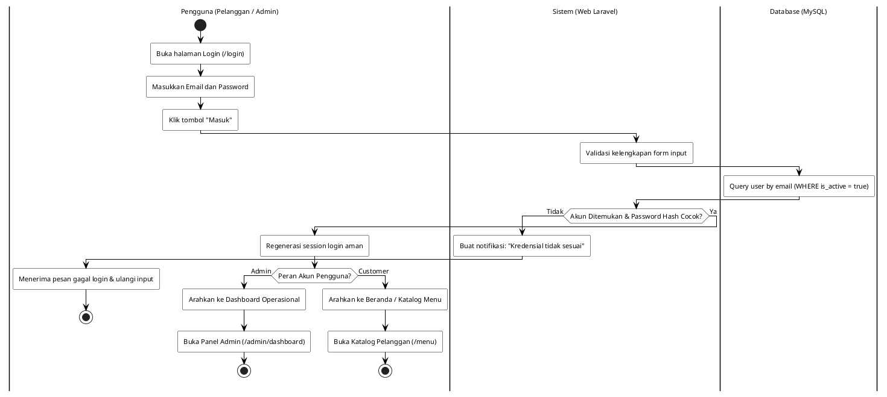
```plantuml
@startuml Activity_Fitur1_Login
skinparam monochrome true
skinparam packageStyle rectangle
skinparam shadowing false
skinparam defaultFontName Arial
skinparam defaultFontSize 11
skinparam roundcorner 4
skinparam ArrowColor #000000
skinparam ActivityBorderColor #000000
skinparam ActivityBackgroundColor #FFFFFF
skinparam ActivityDiamondBorderColor #000000
skinparam ActivityDiamondBackgroundColor #FFFFFF

|Pengguna (Pelanggan / Admin)|
|Sistem (Web Laravel)|
|Database (MySQL)|

|Pengguna (Pelanggan / Admin)|
start
:Buka halaman Login (/login);
:Masukkan Email dan Password;
:Klik tombol "Masuk";

|Sistem (Web Laravel)|
:Validasi kelengkapan form input;

|Database (MySQL)|
:Query user by email (WHERE is_active = true);

|Sistem (Web Laravel)|
if (Akun Ditemukan & Password Hash Cocok?) then (Tidak)
  :Buat notifikasi: "Kredensial tidak sesuai";
  |Pengguna (Pelanggan / Admin)|
  :Menerima pesan gagal login & ulangi input;
  stop
else (Ya)
  :Regenerasi session login aman;
  if (Peran Akun Pengguna?) then (Admin)
    :Arahkan ke Dashboard Operasional;
    |Pengguna (Pelanggan / Admin)|
    :Buka Panel Admin (/admin/dashboard);
    stop
  else (Customer)
    :Arahkan ke Beranda / Katalog Menu;
    |Pengguna (Pelanggan / Admin)|
    :Buka Katalog Pelanggan (/menu);
    stop
  endif
endif
@enduml
```

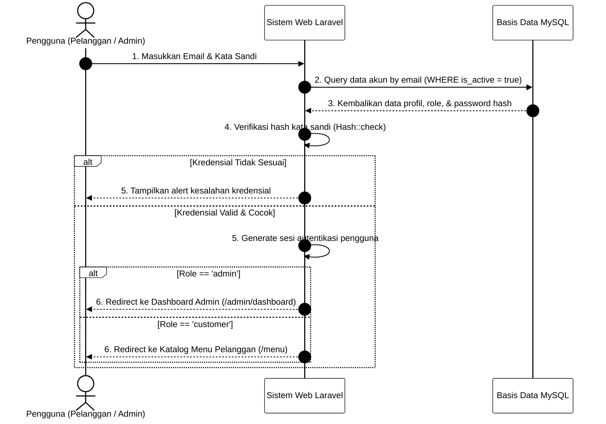
```mermaid
%%{init: {'theme': 'base', 'themeVariables': {'primaryColor': '#ffffff', 'primaryTextColor': '#000000', 'primaryBorderColor': '#000000', 'lineColor': '#000000', 'secondaryColor': '#ffffff', 'tertiaryColor': '#ffffff', 'actorBkg': '#ffffff', 'actorBorder': '#000000', 'actorTextColor': '#000000', 'actorLineColor': '#000000', 'signalColor': '#000000', 'signalTextColor': '#000000', 'labelBoxBkgColor': '#ffffff', 'labelBoxBorderColor': '#000000', 'labelTextColor': '#000000', 'loopTextColor': '#000000', 'noteBorderColor': '#000000', 'noteBkgColor': '#ffffff', 'noteTextColor': '#000000', 'activationBorderColor': '#000000', 'activationBkgColor': '#f4f4f4', 'sequenceNumberColor': '#000000'}}}%%
sequenceDiagram
    autonumber
    actor User as Pengguna (Pelanggan / Admin)
    participant Web as Sistem Web Laravel
    participant DB as Basis Data MySQL

    User->>Web: 1. Masukkan Email & Kata Sandi
    Web->>DB: 2. Query data akun by email (WHERE is_active = true)
    DB-->>Web: 3. Kembalikan data profil, role, & password hash
    Web->>Web: 4. Verifikasi hash kata sandi (Hash::check)

    alt Kredensial Tidak Sesuai
        Web-->>User: 5. Tampilkan alert kesalahan kredensial
    else Kredensial Valid & Cocok
        Web->>Web: 5. Generate sesi autentikasi pengguna
        alt Role == 'admin'
            Web-->>User: 6. Redirect ke Dashboard Admin (/admin/dashboard)
        else Role == 'customer'
            Web-->>User: 6. Redirect ke Katalog Menu Pelanggan (/menu)
        end
    end
```

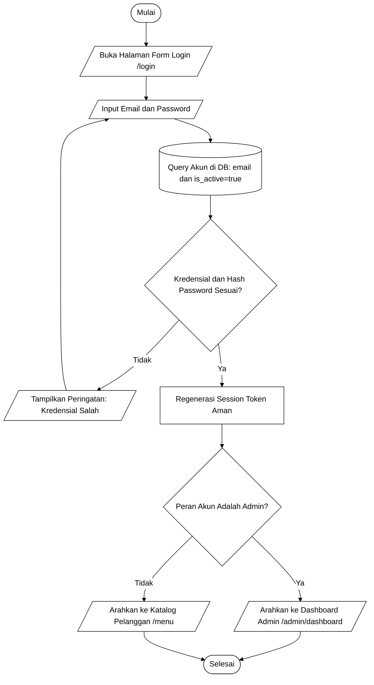
```mermaid
%%{init: {'theme': 'base', 'themeVariables': {'primaryColor': '#ffffff', 'primaryTextColor': '#000000', 'primaryBorderColor': '#000000', 'lineColor': '#000000', 'secondaryColor': '#ffffff', 'tertiaryColor': '#ffffff', 'edgeLabelBackground': '#ffffff', 'nodeTextColor': '#000000'}}}%%
flowchart TD
    StartLogin([Mulai]) --> OpenLoginForm[/Buka Halaman Form Login /login/]
    OpenLoginForm --> InputLogin[/Input Email dan Password/]
    InputLogin --> QueryUser[(Query Akun di DB: email dan is_active=true)]
    QueryUser --> VerifyPass{Kredensial dan Hash Password Sesuai?}
    
    VerifyPass -- Tidak --> ShowLoginError[/Tampilkan Peringatan: Kredensial Salah/]
    ShowLoginError --> InputLogin
    
    VerifyPass -- Ya --> CreateSession[Regenerasi Session Token Aman]
    CreateSession --> CheckAdmin{Peran Akun Adalah Admin?}
    
    CheckAdmin -- Ya --> RedirectAdmin[/Arahkan ke Dashboard Admin /admin/dashboard/]
    CheckAdmin -- Tidak --> RedirectCustomer[/Arahkan ke Katalog Pelanggan /menu/]
    
    RedirectAdmin --> EndLogin([Selesai])
    RedirectCustomer --> EndLogin
```
---

## 4. Fitur 2: Katalog Menu & Paket Catering Nasi Uduk

Menyajikan daftar hidangan Nasi Uduk dalam 3 kategori penyajian: porsi satuan, nasi box, dan prasmanan/catering dengan kelengkapan foto, deskripsi lauk pauk, harga satuan, dan batas minimal pemesanan.

### 4.1 Activity Diagram (PlantUML - 3 Swimlane)
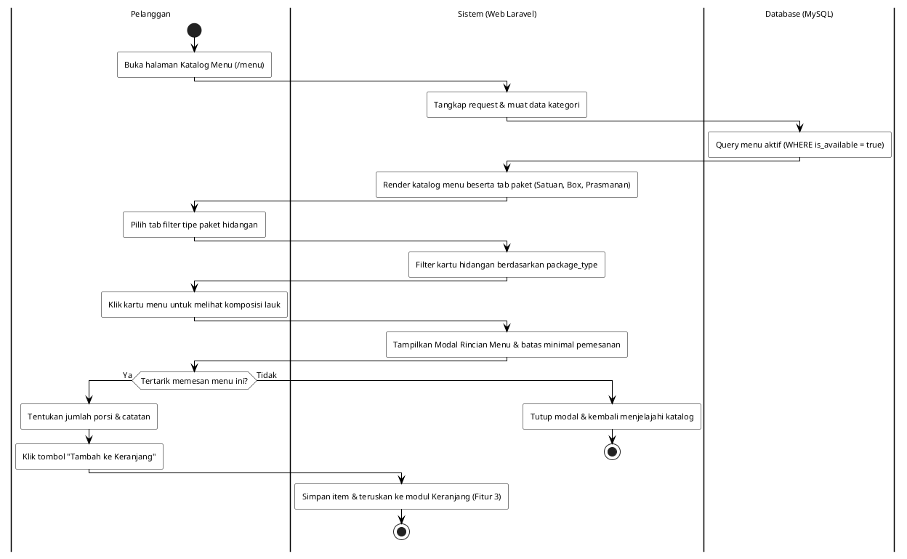
```plantuml
@startuml Activity_Fitur2_Katalog
skinparam monochrome true
skinparam packageStyle rectangle
skinparam shadowing false
skinparam defaultFontName Arial
skinparam defaultFontSize 11
skinparam roundcorner 4
skinparam ArrowColor #000000
skinparam ActivityBorderColor #000000
skinparam ActivityBackgroundColor #FFFFFF
skinparam ActivityDiamondBorderColor #000000
skinparam ActivityDiamondBackgroundColor #FFFFFF

|Pelanggan|
|Sistem (Web Laravel)|
|Database (MySQL)|

|Pelanggan|
start
:Buka halaman Katalog Menu (/menu);

|Sistem (Web Laravel)|
:Tangkap request & muat data kategori;

|Database (MySQL)|
:Query menu aktif (WHERE is_available = true);

|Sistem (Web Laravel)|
:Render katalog menu beserta tab paket (Satuan, Box, Prasmanan);

|Pelanggan|
:Pilih tab filter tipe paket hidangan;

|Sistem (Web Laravel)|
:Filter kartu hidangan berdasarkan package_type;

|Pelanggan|
:Klik kartu menu untuk melihat komposisi lauk;

|Sistem (Web Laravel)|
:Tampilkan Modal Rincian Menu & batas minimal pemesanan;

|Pelanggan|
if (Tertarik memesan menu ini?) then (Ya)
  :Tentukan jumlah porsi & catatan;
  :Klik tombol "Tambah ke Keranjang";
  |Sistem (Web Laravel)|
  :Simpan item & teruskan ke modul Keranjang (Fitur 3);
  stop
else (Tidak)
  :Tutup modal & kembali menjelajahi katalog;
  stop
endif
@enduml
```

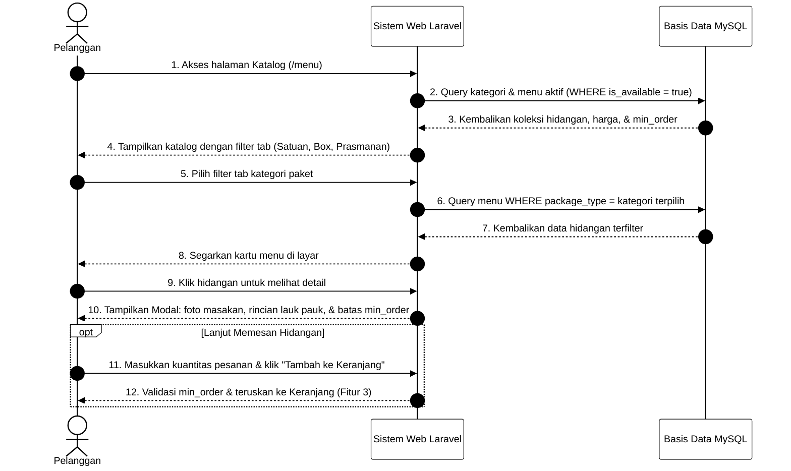
```mermaid
%%{init: {'theme': 'base', 'themeVariables': {'primaryColor': '#ffffff', 'primaryTextColor': '#000000', 'primaryBorderColor': '#000000', 'lineColor': '#000000', 'secondaryColor': '#ffffff', 'tertiaryColor': '#ffffff', 'actorBkg': '#ffffff', 'actorBorder': '#000000', 'actorTextColor': '#000000', 'actorLineColor': '#000000', 'signalColor': '#000000', 'signalTextColor': '#000000', 'labelBoxBkgColor': '#ffffff', 'labelBoxBorderColor': '#000000', 'labelTextColor': '#000000', 'loopTextColor': '#000000', 'noteBorderColor': '#000000', 'noteBkgColor': '#ffffff', 'noteTextColor': '#000000', 'activationBorderColor': '#000000', 'activationBkgColor': '#f4f4f4', 'sequenceNumberColor': '#000000'}}}%%
sequenceDiagram
    autonumber
    actor Cust as Pelanggan
    participant Web as Sistem Web Laravel
    participant DB as Basis Data MySQL

    Cust->>Web: 1. Akses halaman Katalog (/menu)
    Web->>DB: 2. Query kategori & menu aktif (WHERE is_available = true)
    DB-->>Web: 3. Kembalikan koleksi hidangan, harga, & min_order
    Web-->>Cust: 4. Tampilkan katalog dengan filter tab (Satuan, Box, Prasmanan)
    
    Cust->>Web: 5. Pilih filter tab kategori paket
    Web->>DB: 6. Query menu WHERE package_type = kategori terpilih
    DB-->>Web: 7. Kembalikan data hidangan terfilter
    Web-->>Cust: 8. Segarkan kartu menu di layar
    
    Cust->>Web: 9. Klik hidangan untuk melihat detail
    Web-->>Cust: 10. Tampilkan Modal: foto masakan, rincian lauk pauk, & batas min_order
    
    opt Lanjut Memesan Hidangan
        Cust->>Web: 11. Masukkan kuantitas pesanan & klik "Tambah ke Keranjang"
        Web-->>Cust: 12. Validasi min_order & teruskan ke Keranjang (Fitur 3)
    end
```

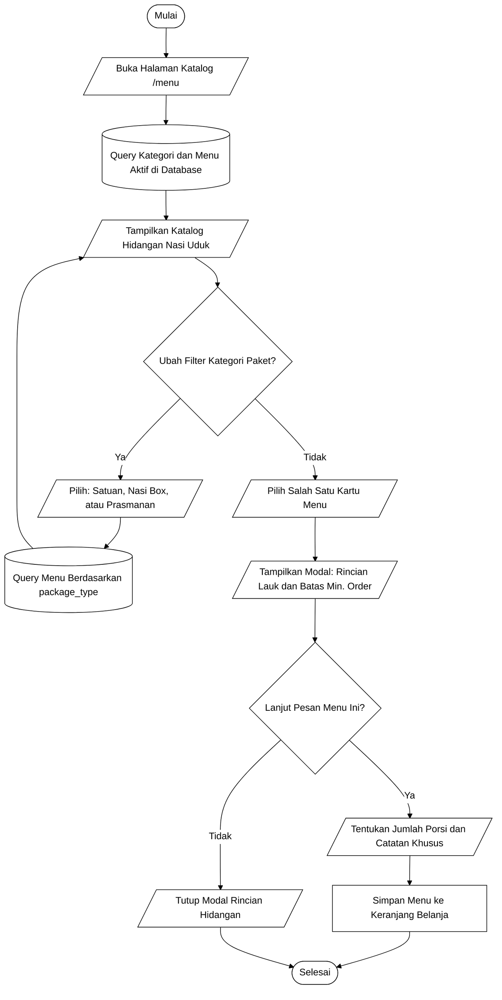
```mermaid
%%{init: {'theme': 'base', 'themeVariables': {'primaryColor': '#ffffff', 'primaryTextColor': '#000000', 'primaryBorderColor': '#000000', 'lineColor': '#000000', 'secondaryColor': '#ffffff', 'tertiaryColor': '#ffffff', 'edgeLabelBackground': '#ffffff', 'nodeTextColor': '#000000'}}}%%
flowchart TD
    StartCat([Mulai]) --> OpenPage[/Buka Halaman Katalog /menu/]
    OpenPage --> FetchDB[(Query Kategori dan Menu Aktif di Database)]
    FetchDB --> DisplayGrid[/Tampilkan Katalog Hidangan Nasi Uduk/]
    
    DisplayGrid --> FilterChoice{Ubah Filter Kategori Paket?}
    FilterChoice -- Ya --> PickCategory[/Pilih: Satuan, Nasi Box, atau Prasmanan/]
    PickCategory --> FilterQuery[(Query Menu Berdasarkan package_type)]
    FilterQuery --> DisplayGrid
    
    FilterChoice -- Tidak --> SelectItem[/Pilih Salah Satu Kartu Menu/]
    SelectItem --> ShowModal[/Tampilkan Modal: Rincian Lauk dan Batas Min. Order/]
    
    ShowModal --> BuyDecision{Lanjut Pesan Menu Ini?}
    BuyDecision -- Ya --> InputQty[/Tentukan Jumlah Porsi dan Catatan Khusus/]
    InputQty --> AddCart[Simpan Menu ke Keranjang Belanja]
    AddCart --> EndCat([Selesai])
    
    BuyDecision -- Tidak --> CloseModal[/Tutup Modal Rincian Hidangan/]
    CloseModal --> EndCat
```

---

## 5. Fitur 3: Manajemen Keranjang Pesanan (Cart Management)

Menyimpan hidangan pesanan sementara, mengatur penambahan jumlah porsi dengan validasi otomatis terhadap batas minimal order (*minimum order constraint*), memperbarui catatan khusus, serta mengkalkulasi subtotal belanja secara dinamis.

### 5.1 Activity Diagram (PlantUML - 3 Swimlane)
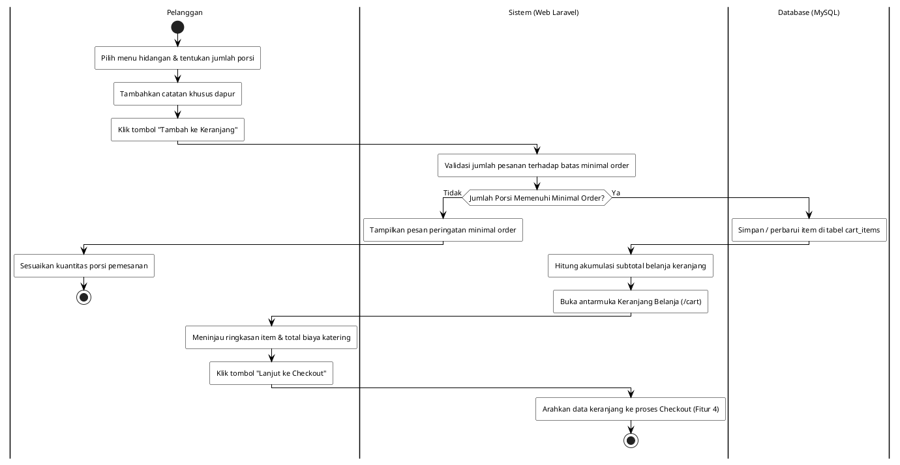
```plantuml
@startuml Activity_Fitur3_Keranjang
skinparam monochrome true
skinparam packageStyle rectangle
skinparam shadowing false
skinparam defaultFontName Arial
skinparam defaultFontSize 11
skinparam roundcorner 4
skinparam ArrowColor #000000
skinparam ActivityBorderColor #000000
skinparam ActivityBackgroundColor #FFFFFF
skinparam ActivityDiamondBorderColor #000000
skinparam ActivityDiamondBackgroundColor #FFFFFF

|Pelanggan|
|Sistem (Web Laravel)|
|Database (MySQL)|

|Pelanggan|
start
:Pilih menu hidangan & tentukan jumlah porsi;
:Tambahkan catatan khusus dapur;
:Klik tombol "Tambah ke Keranjang";

|Sistem (Web Laravel)|
:Validasi jumlah pesanan terhadap batas minimal order;

if (Jumlah Porsi Memenuhi Minimal Order?) then (Tidak)
  :Tampilkan pesan peringatan minimal order;
  |Pelanggan|
  :Sesuaikan kuantitas porsi pemesanan;
  stop
else (Ya)
  |Database (MySQL)|
  :Simpan / perbarui item di tabel cart_items;
  |Sistem (Web Laravel)|
  :Hitung akumulasi subtotal belanja keranjang;
  :Buka antarmuka Keranjang Belanja (/cart);
  |Pelanggan|
  :Meninjau ringkasan item & total biaya katering;
  :Klik tombol "Lanjut ke Checkout";
  |Sistem (Web Laravel)|
  :Arahkan data keranjang ke proses Checkout (Fitur 4);
  stop
endif
@enduml
```

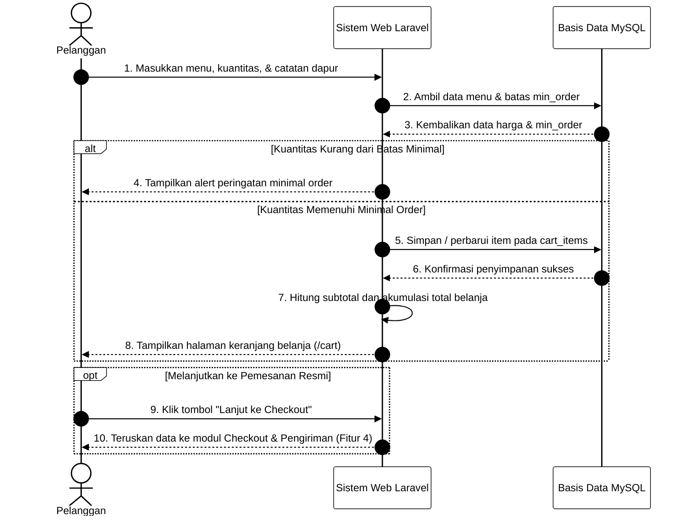
```mermaid
%%{init: {'theme': 'base', 'themeVariables': {'primaryColor': '#ffffff', 'primaryTextColor': '#000000', 'primaryBorderColor': '#000000', 'lineColor': '#000000', 'secondaryColor': '#ffffff', 'tertiaryColor': '#ffffff', 'actorBkg': '#ffffff', 'actorBorder': '#000000', 'actorTextColor': '#000000', 'actorLineColor': '#000000', 'signalColor': '#000000', 'signalTextColor': '#000000', 'labelBoxBkgColor': '#ffffff', 'labelBoxBorderColor': '#000000', 'labelTextColor': '#000000', 'loopTextColor': '#000000', 'noteBorderColor': '#000000', 'noteBkgColor': '#ffffff', 'noteTextColor': '#000000', 'activationBorderColor': '#000000', 'activationBkgColor': '#f4f4f4', 'sequenceNumberColor': '#000000'}}}%%
sequenceDiagram
    autonumber
    actor Cust as Pelanggan
    participant Web as Sistem Web Laravel
    participant DB as Basis Data MySQL

    Cust->>Web: 1. Masukkan menu, kuantitas, & catatan dapur
    Web->>DB: 2. Ambil data menu & batas min_order
    DB-->>Web: 3. Kembalikan data harga & min_order

    alt Kuantitas Kurang dari Batas Minimal
        Web-->>Cust: 4. Tampilkan alert peringatan minimal order
    else Kuantitas Memenuhi Minimal Order
        Web->>DB: 5. Simpan / perbarui item pada cart_items
        DB-->>Web: 6. Konfirmasi penyimpanan sukses
        Web->>Web: 7. Hitung subtotal dan akumulasi total belanja
        Web-->>Cust: 8. Tampilkan halaman keranjang belanja (/cart)
    end

    opt Melanjutkan ke Pemesanan Resmi
        Cust->>Web: 9. Klik tombol "Lanjut ke Checkout"
        Web-->>Cust: 10. Teruskan data ke modul Checkout & Pengiriman (Fitur 4)
    end
```

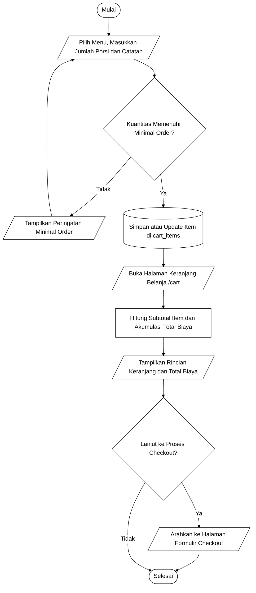
```mermaid
%%{init: {'theme': 'base', 'themeVariables': {'primaryColor': '#ffffff', 'primaryTextColor': '#000000', 'primaryBorderColor': '#000000', 'lineColor': '#000000', 'secondaryColor': '#ffffff', 'tertiaryColor': '#ffffff', 'edgeLabelBackground': '#ffffff', 'nodeTextColor': '#000000'}}}%%
flowchart TD
    StartCart([Mulai]) --> SelectItem[/Pilih Menu, Masukkan Jumlah Porsi dan Catatan/]
    SelectItem --> CheckMinOrder{Kuantitas Memenuhi Minimal Order?}
    
    CheckMinOrder -- Tidak --> ShowMinWarning[/Tampilkan Peringatan Minimal Order/]
    ShowMinWarning --> SelectItem
    
    CheckMinOrder -- Ya --> SaveCart[(Simpan atau Update Item di cart_items)]
    SaveCart --> OpenCartView[/Buka Halaman Keranjang Belanja /cart/]
    OpenCartView --> CalcTotals[Hitung Subtotal Item dan Akumulasi Total Biaya]
    CalcTotals --> ShowCartView[/Tampilkan Rincian Keranjang dan Total Biaya/]
    
    ShowCartView --> ProceedCheckout{Lanjut ke Proses Checkout?}
    ProceedCheckout -- Ya --> RedirectCheckout[/Arahkan ke Halaman Formulir Checkout/]
    RedirectCheckout --> EndCart([Selesai])
    
    ProceedCheckout -- Tidak --> EndCart
```

---

## 6. Fitur 4: Checkout, Penjadwalan, Validasi Radius Area Jakarta & Form Pengiriman

Memproses pesanan dari keranjang menjadi entitas pesanan resmi (*Order*), mencakup penentuan titik lokasi pengantaran dengan peta interaktif **Leaflet.js (OpenStreetMap)**, validasi batas jangkauan radius maksimal **20 km (Wilayah DKI Jakarta)** menggunakan formula Haversine, validasi minimal waktu pemesanan **H-1** (karena makanan olahan santan mudah basi sehingga wajib dikirim *fresh* di hari-H acara), pemilihan opsi pengiriman (*Pick-up* atau *Delivery*), serta pembuatan nomor faktur unik.

### 6.1 Activity Diagram (PlantUML - 3 Swimlane)
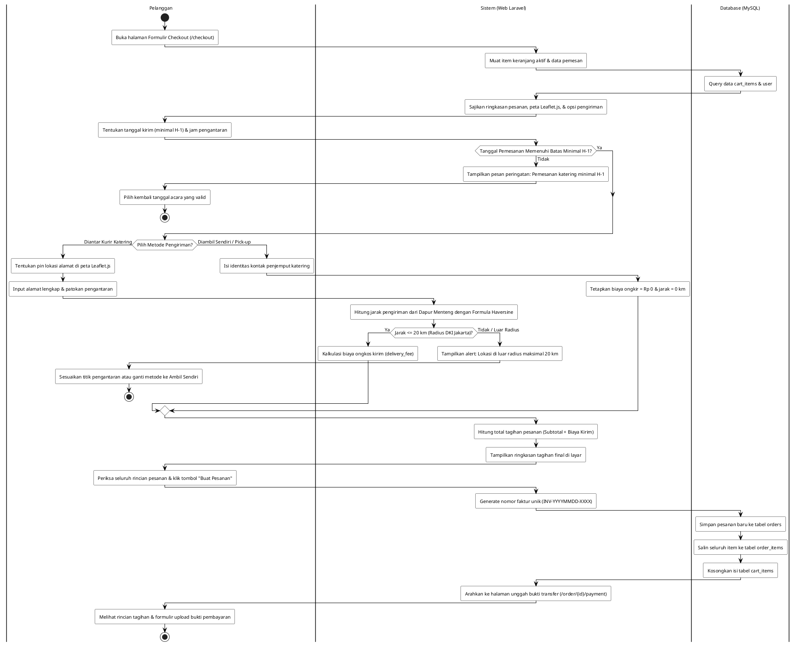
```plantuml
@startuml Activity_Fitur4_Checkout
skinparam monochrome true
skinparam packageStyle rectangle
skinparam shadowing false
skinparam defaultFontName Arial
skinparam defaultFontSize 11
skinparam roundcorner 4
skinparam ArrowColor #000000
skinparam ActivityBorderColor #000000
skinparam ActivityBackgroundColor #FFFFFF
skinparam ActivityDiamondBorderColor #000000
skinparam ActivityDiamondBackgroundColor #FFFFFF

|Pelanggan|
|Sistem (Web Laravel)|
|Database (MySQL)|

|Pelanggan|
start
:Buka halaman Formulir Checkout (/checkout);

|Sistem (Web Laravel)|
:Muat item keranjang aktif & data pemesan;
|Database (MySQL)|
:Query data cart_items & user;

|Sistem (Web Laravel)|
:Sajikan ringkasan pesanan, peta Leaflet.js, & opsi pengiriman;

|Pelanggan|
:Tentukan tanggal kirim (minimal H-1) & jam pengantaran;

|Sistem (Web Laravel)|
if (Tanggal Pemesanan Memenuhi Batas Minimal H-1?) then (Tidak)
  :Tampilkan pesan peringatan: Pemesanan katering minimal H-1;
  |Pelanggan|
  :Pilih kembali tanggal acara yang valid;
  stop
else (Ya)
endif

|Pelanggan|
if (Pilih Metode Pengiriman?) then (Diantar Kurir Katering)
  :Tentukan pin lokasi alamat di peta Leaflet.js;
  :Input alamat lengkap & patokan pengantaran;
  
  |Sistem (Web Laravel)|
  :Hitung jarak pengiriman dari Dapur Menteng dengan Formula Haversine;
  
  if (Jarak <= 20 km (Radius DKI Jakarta)?) then (Ya)
    :Kalkulasi biaya ongkos kirim (delivery_fee);
  else (Tidak / Luar Radius)
    :Tampilkan alert: Lokasi di luar radius maksimal 20 km;
    |Pelanggan|
    :Sesuaikan titik pengantaran atau ganti metode ke Ambil Sendiri;
    stop
  endif
else (Diambil Sendiri / Pick-up)
  |Pelanggan|
  :Isi identitas kontak penjemput katering;
  |Sistem (Web Laravel)|
  :Tetapkan biaya ongkir = Rp 0 & jarak = 0 km;
endif

|Sistem (Web Laravel)|
:Hitung total tagihan pesanan (Subtotal + Biaya Kirim);
:Tampilkan ringkasan tagihan final di layar;

|Pelanggan|
:Periksa seluruh rincian pesanan & klik tombol "Buat Pesanan";

|Sistem (Web Laravel)|
:Generate nomor faktur unik (INV-YYYYMMDD-XXXX);
|Database (MySQL)|
:Simpan pesanan baru ke tabel orders;
:Salin seluruh item ke tabel order_items;
:Kosongkan isi tabel cart_items;

|Sistem (Web Laravel)|
:Arahkan ke halaman unggah bukti transfer (/order/{id}/payment);

|Pelanggan|
:Melihat rincian tagihan & formulir upload bukti pembayaran;
stop
@enduml
```

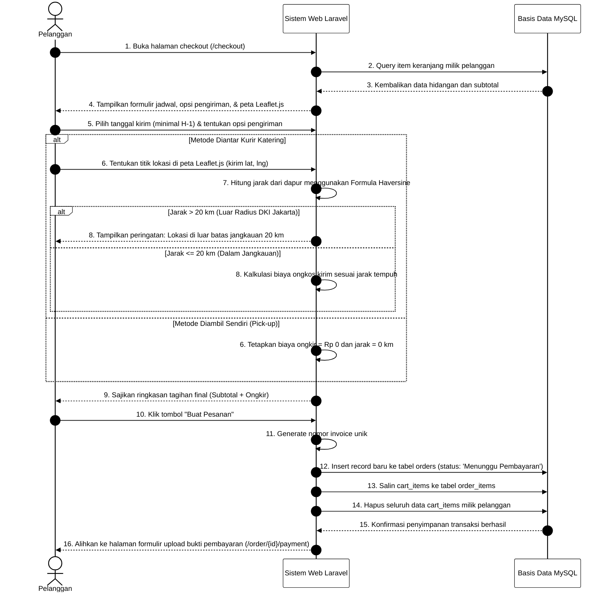
```mermaid
%%{init: {'theme': 'base', 'themeVariables': {'primaryColor': '#ffffff', 'primaryTextColor': '#000000', 'primaryBorderColor': '#000000', 'lineColor': '#000000', 'secondaryColor': '#ffffff', 'tertiaryColor': '#ffffff', 'actorBkg': '#ffffff', 'actorBorder': '#000000', 'actorTextColor': '#000000', 'actorLineColor': '#000000', 'signalColor': '#000000', 'signalTextColor': '#000000', 'labelBoxBkgColor': '#ffffff', 'labelBoxBorderColor': '#000000', 'labelTextColor': '#000000', 'loopTextColor': '#000000', 'noteBorderColor': '#000000', 'noteBkgColor': '#ffffff', 'noteTextColor': '#000000', 'activationBorderColor': '#000000', 'activationBkgColor': '#f4f4f4', 'sequenceNumberColor': '#000000'}}}%%
sequenceDiagram
    autonumber
    actor Cust as Pelanggan
    participant Web as Sistem Web Laravel
    participant DB as Basis Data MySQL

    Cust->>Web: 1. Buka halaman checkout (/checkout)
    Web->>DB: 2. Query item keranjang milik pelanggan
    DB-->>Web: 3. Kembalikan data hidangan dan subtotal
    Web-->>Cust: 4. Tampilkan formulir jadwal, opsi pengiriman, & peta Leaflet.js

    Cust->>Web: 5. Pilih tanggal kirim (minimal H-1) & tentukan opsi pengiriman

    alt Metode Diantar Kurir Katering
        Cust->>Web: 6. Tentukan titik lokasi di peta Leaflet.js (kirim lat, lng)
        Web->>Web: 7. Hitung jarak dari dapur menggunakan Formula Haversine
        alt Jarak > 20 km (Luar Radius DKI Jakarta)
            Web-->>Cust: 8. Tampilkan peringatan: Lokasi di luar batas jangkauan 20 km
        else Jarak <= 20 km (Dalam Jangkauan)
            Web->>Web: 8. Kalkulasi biaya ongkos kirim sesuai jarak tempuh
        end
    else Metode Diambil Sendiri (Pick-up)
        Web->>Web: 6. Tetapkan biaya ongkir = Rp 0 dan jarak = 0 km
    end

    Web-->>Cust: 9. Sajikan ringkasan tagihan final (Subtotal + Ongkir)
    Cust->>Web: 10. Klik tombol "Buat Pesanan"
    Web->>Web: 11. Generate nomor invoice unik
    Web->>DB: 12. Insert record baru ke tabel orders (status: 'Menunggu Pembayaran')
    Web->>DB: 13. Salin cart_items ke tabel order_items
    Web->>DB: 14. Hapus seluruh data cart_items milik pelanggan
    DB-->>Web: 15. Konfirmasi penyimpanan transaksi berhasil
    Web-->>Cust: 16. Alihkan ke halaman formulir upload bukti pembayaran (/order/{id}/payment)
```

```mermaid
%%{init: {'theme': 'base', 'themeVariables': {'primaryColor': '#ffffff', 'primaryTextColor': '#000000', 'primaryBorderColor': '#000000', 'lineColor': '#000000', 'secondaryColor': '#ffffff', 'tertiaryColor': '#ffffff', 'edgeLabelBackground': '#ffffff', 'nodeTextColor': '#000000'}}}%%
flowchart TD
    StartCheckout([Mulai]) --> LoadCart[(Ambil Data Keranjang Belanja di DB)]
    LoadCart --> RenderForm[/Tampilkan Form Jadwal, Peta Leaflet dan Opsi Pengiriman/]
    
    RenderForm --> InputSchedule[/Pilih Tanggal Acara dan Waktu Pengantaran/]
    InputSchedule --> CheckLeadTime{Tanggal Pemesanan Minimal H+1?}
    
    CheckLeadTime -- Tidak --> AlertLeadError[/Tampilkan Error: Minimal Pesan H-1/]
    AlertLeadError --> InputSchedule
    
    CheckLeadTime -- Ya --> IsDelivery{Metode Pengiriman Diantar Kurir?}
    
    IsDelivery -- Tidak --> SetZeroFee[Biaya Ongkir = Rp 0 dan Jarak = 0 km]
    
    IsDelivery -- Ya --> PinMap[/Tentukan Titik Alamat di Peta Leaflet.js/]
    PinMap --> CalcDistance[Hitung Jarak Haversine vs Dapur Menteng]
    CalcDistance --> CheckRadius{Jarak Maksimal 20 km Area Jakarta?}
    
    CheckRadius -- Tidak --> AlertRadiusError[/Error: Lokasi di Luar Radius Maks 20 km/]
    AlertRadiusError --> ChangeOption{Ganti Metode ke Diambil Sendiri?}
    ChangeOption -- Ya --> SetZeroFee
    ChangeOption -- Tidak --> PinMap
    
    CheckRadius -- Ya --> AddDeliveryFee[Tambahkan Ongkir Sesuai Jarak dan Simpan Koordinat]
    
    SetZeroFee --> CalcFinalTotal[Hitung Total Akhir = Subtotal + Ongkir]
    AddDeliveryFee --> CalcFinalTotal
    
    CalcFinalTotal --> ReviewOrder[/Tampilkan Ringkasan Pesanan dan Total Biaya/]
    ReviewOrder --> SubmitOrder[/Klik Buat Pesanan/]
    
    SubmitOrder --> GenerateInv[Generate Nomor Invoice Unik]
    GenerateInv --> SaveOrderDB[(Insert Record ke Tabel orders)]
    SaveOrderDB --> SaveItemsDB[(Salin ke Tabel order_items)]
    SaveItemsDB --> ClearCartDB[(Hapus Item dari cart_items)]
    ClearCartDB --> RedirectUpload[/Arahkan ke Form Upload Bukti Transfer /order/payment/]
    RedirectUpload --> EndCheckout([Selesai])
```
---

## 7. Fitur 5: Unggah Bukti Pembayaran Transfer Bank Manual (Tanpa Payment Gateway)

Sistem pembayaran katering menggunakan transfer bank manual langsung ke rekening usaha (BCA / Mandiri). Pelanggan hanya mengunggah file foto/gambar bukti transfer (struk ATM / bukti m-banking), kemudian sistem menyimpan berkas bukti dan mengubah status pesanan menjadi "Menunggu Konfirmasi Admin". Tidak ada integrasi dengan layanan payment gateway pihak ketiga.

### 7.1 Activity Diagram (PlantUML - 3 Swimlane)
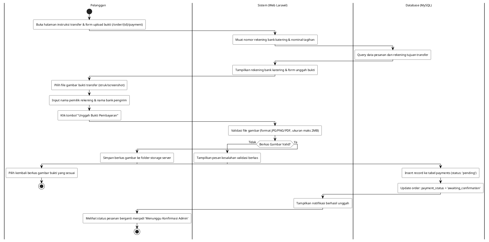
```plantuml
@startuml Activity_Fitur5_Pembayaran
skinparam monochrome true
skinparam packageStyle rectangle
skinparam shadowing false
skinparam defaultFontName Arial
skinparam defaultFontSize 11
skinparam roundcorner 4
skinparam ArrowColor #000000
skinparam ActivityBorderColor #000000
skinparam ActivityBackgroundColor #FFFFFF
skinparam ActivityDiamondBorderColor #000000
skinparam ActivityDiamondBackgroundColor #FFFFFF

|Pelanggan|
|Sistem (Web Laravel)|
|Database (MySQL)|

|Pelanggan|
start
:Buka halaman instruksi transfer & form upload bukti (/order/{id}/payment);

|Sistem (Web Laravel)|
:Muat nomor rekening bank katering & nominal tagihan;
|Database (MySQL)|
:Query data pesanan dan rekening tujuan transfer;

|Sistem (Web Laravel)|
:Tampilkan rekening bank katering & form unggah bukti;

|Pelanggan|
:Pilih file gambar bukti transfer (struk/screenshot);
:Input nama pemilik rekening & nama bank pengirim;
:Klik tombol "Unggah Bukti Pembayaran";

|Sistem (Web Laravel)|
:Validasi file gambar (format JPG/PNG/PDF, ukuran maks 2MB);

if (Berkas Gambar Valid?) then (Tidak)
  :Tampilkan pesan kesalahan validasi berkas;
  |Pelanggan|
  :Pilih kembali berkas gambar bukti yang sesuai;
  stop
else (Ya)
  :Simpan berkas gambar ke folder storage server;
  |Database (MySQL)|
  :Insert record ke tabel payments (status: 'pending');
  :Update order: payment_status = 'awaiting_confirmation';
  |Sistem (Web Laravel)|
  :Tampilkan notifikasi berhasil unggah;
  |Pelanggan|
  :Melihat status pesanan berganti menjadi 'Menunggu Konfirmasi Admin';
  stop
endif
@enduml
```

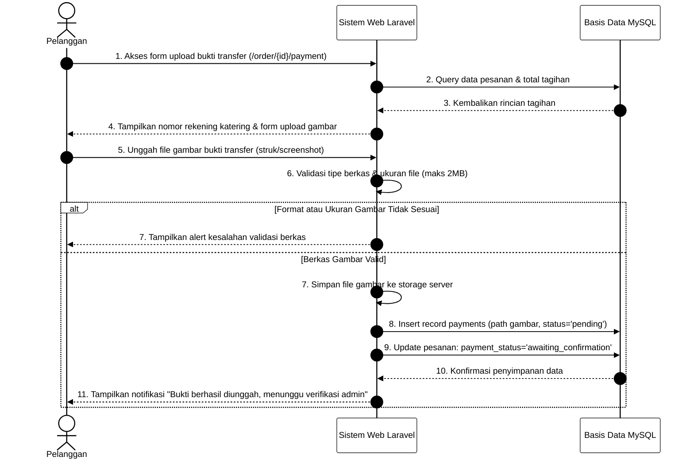
```mermaid
%%{init: {'theme': 'base', 'themeVariables': {'primaryColor': '#ffffff', 'primaryTextColor': '#000000', 'primaryBorderColor': '#000000', 'lineColor': '#000000', 'secondaryColor': '#ffffff', 'tertiaryColor': '#ffffff', 'actorBkg': '#ffffff', 'actorBorder': '#000000', 'actorTextColor': '#000000', 'actorLineColor': '#000000', 'signalColor': '#000000', 'signalTextColor': '#000000', 'labelBoxBkgColor': '#ffffff', 'labelBoxBorderColor': '#000000', 'labelTextColor': '#000000', 'loopTextColor': '#000000', 'noteBorderColor': '#000000', 'noteBkgColor': '#ffffff', 'noteTextColor': '#000000', 'activationBorderColor': '#000000', 'activationBkgColor': '#f4f4f4', 'sequenceNumberColor': '#000000'}}}%%
sequenceDiagram
    autonumber
    actor Cust as Pelanggan
    participant Web as Sistem Web Laravel
    participant DB as Basis Data MySQL

    Cust->>Web: 1. Akses form upload bukti transfer (/order/{id}/payment)
    Web->>DB: 2. Query data pesanan & total tagihan
    DB-->>Web: 3. Kembalikan rincian tagihan
    Web-->>Cust: 4. Tampilkan nomor rekening katering & form upload gambar

    Cust->>Web: 5. Unggah file gambar bukti transfer (struk/screenshot)
    Web->>Web: 6. Validasi tipe berkas & ukuran file (maks 2MB)

    alt Format atau Ukuran Gambar Tidak Sesuai
        Web-->>Cust: 7. Tampilkan alert kesalahan validasi berkas
    else Berkas Gambar Valid
        Web->>Web: 7. Simpan file gambar ke storage server
        Web->>DB: 8. Insert record payments (path gambar, status='pending')
        Web->>DB: 9. Update pesanan: payment_status='awaiting_confirmation'
        DB-->>Web: 10. Konfirmasi penyimpanan data
        Web-->>Cust: 11. Tampilkan notifikasi "Bukti berhasil diunggah, menunggu verifikasi admin"
    end
```
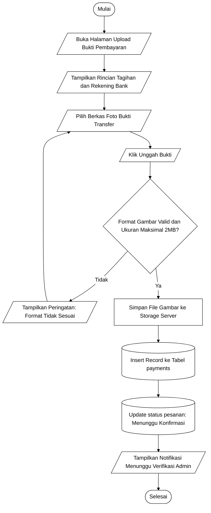
```mermaid
%%{init: {'theme': 'base', 'themeVariables': {'primaryColor': '#ffffff', 'primaryTextColor': '#000000', 'primaryBorderColor': '#000000', 'lineColor': '#000000', 'secondaryColor': '#ffffff', 'tertiaryColor': '#ffffff', 'edgeLabelBackground': '#ffffff', 'nodeTextColor': '#000000'}}}%%
flowchart TD
    StartPay([Mulai]) --> OpenPayPage[/Buka Halaman Upload Bukti Pembayaran/]
    OpenPayPage --> ShowPayInfo[/Tampilkan Rincian Tagihan dan Rekening Bank/]
    ShowPayInfo --> UploadProof[/Pilih Berkas Foto Bukti Transfer/]
    UploadProof --> SubmitProof[/Klik Unggah Bukti/]
    
    SubmitProof --> ValidateFile{Format Gambar Valid dan Ukuran Maksimal 2MB?}
    ValidateFile -- Tidak --> ShowFileError[/Tampilkan Peringatan: Format Tidak Sesuai/]
    ShowFileError --> UploadProof
    
    ValidateFile -- Ya --> SaveImage[Simpan File Gambar ke Storage Server]
    SaveImage --> SavePaymentDB[(Insert Record ke Tabel payments)]
    SavePaymentDB --> UpdateOrderStatus[(Update status pesanan: Menunggu Konfirmasi)]
    UpdateOrderStatus --> ShowSuccessMsg[/Tampilkan Notifikasi Menunggu Verifikasi Admin/]
    ShowSuccessMsg --> EndPay([Selesai])
```
---

## 8. Fitur 6: Riwayat Transaksi & Pelacakan Status Pesanan

Menyediakan daftar riwayat pesanan pelanggan masa lalu, tampilan status pesanan *real-time* berbasis lini masa (*timeline* 4 tahap: Menunggu Pembayaran $\rightarrow$ Diproses Dapur $\rightarrow$ Dikirim/Siap Ambil $\rightarrow$ Selesai), serta fitur unduh/cetak invoice digital.

### 8.1 Activity Diagram (PlantUML - 3 Swimlane)
```plantuml
@startuml Activity_Fitur6_Tracking
skinparam monochrome true
skinparam packageStyle rectangle
skinparam shadowing false
skinparam defaultFontName Arial
skinparam defaultFontSize 11
skinparam roundcorner 4
skinparam ArrowColor #000000
skinparam ActivityBorderColor #000000
skinparam ActivityBackgroundColor #FFFFFF
skinparam ActivityDiamondBorderColor #000000
skinparam ActivityDiamondBackgroundColor #FFFFFF

|Aktor (Pelanggan)|
|Sistem (Web Laravel)|
|Database (MySQL)|

|Aktor (Pelanggan)|
start
:Buka menu "Riwayat Pesanan";

|Sistem (Web Laravel)|
|Database (MySQL)|
:Query seluruh transaksi pesanan milik user aktif;

|Sistem (Web Laravel)|
:Sajikan daftar kartu pesanan beserta lencana status;

|Aktor (Pelanggan)|
:Pilih satu pesanan untuk melacak status;

|Sistem (Web Laravel)|
|Database (MySQL)|
:Query detail order, order_items, dan data pembayaran;

|Sistem (Web Laravel)|
:Render timeline progres:
1. Menunggu Pembayaran / Verifikasi
2. Diproses (Dapur Memasak)
3. Dikirim / Siap Diambil
4. Pesanan Selesai;

|Aktor (Pelanggan)|
:Memeriksa status terkini pesanan di layar;

if (Ingin Cetak Nota / Invoice?) then (Ya)
  :Klik tombol "Cetak / Unduh Nota";
  |Sistem (Web Laravel)|
  :Generate lembar invoice elektronik;
  |Aktor (Pelanggan)|
  :Simpan/cetak dokumen invoice pesanan;
  stop
else (Hanya Memantau)
  stop
endif
@enduml
```

```mermaid
%%{init: {'theme': 'base', 'themeVariables': {'primaryColor': '#ffffff', 'primaryTextColor': '#000000', 'primaryBorderColor': '#000000', 'lineColor': '#000000', 'secondaryColor': '#ffffff', 'tertiaryColor': '#ffffff', 'actorBkg': '#ffffff', 'actorBorder': '#000000', 'actorTextColor': '#000000', 'actorLineColor': '#000000', 'signalColor': '#000000', 'signalTextColor': '#000000', 'labelBoxBkgColor': '#ffffff', 'labelBoxBorderColor': '#000000', 'labelTextColor': '#000000', 'loopTextColor': '#000000', 'noteBorderColor': '#000000', 'noteBkgColor': '#ffffff', 'noteTextColor': '#000000', 'activationBorderColor': '#000000', 'activationBkgColor': '#f4f4f4', 'sequenceNumberColor': '#000000'}}}%%
sequenceDiagram
    autonumber
    actor Cust as Aktor: Pelanggan
    participant Sistem as Sistem: Web App Laravel
    participant DB as Database: MySQL Database

    Cust->>Sistem: 1. Akses menu Riwayat Pesanan (/orders)
    Sistem->>DB: 2. Query daftar order milik user (order by created_at desc)
    DB-->>Sistem: 3. Kembalikan daftar transaksi dan status
    Sistem-->>Cust: 4. Tampilkan tabel riwayat pesanan dengan badge status

    Cust->>Sistem: 5. Klik tombol "Lacak Pesanan" pada salah satu nomor faktur
    Sistem->>DB: 6. Query relasi order, order_items, payment, dan log status
    DB-->>Sistem: 7. Kembalikan data lengkap pesanan
    Sistem-->>Cust: 8. Tampilkan timeline status (Menunggu Bayar -> Diproses -> Dikirim -> Selesai)
    
    opt Cetak Nota Pembelian
        Cust->>Sistem: 9. Klik tombol "Cetak Nota / Invoice"
        Sistem-->>Cust: 10. Sajikan tampilan print-friendly atau unduhan file invoice
    end
```

```mermaid
%%{init: {'theme': 'base', 'themeVariables': {'primaryColor': '#ffffff', 'primaryTextColor': '#000000', 'primaryBorderColor': '#000000', 'lineColor': '#000000', 'secondaryColor': '#ffffff', 'tertiaryColor': '#ffffff', 'edgeLabelBackground': '#ffffff', 'nodeTextColor': '#000000'}}}%%
flowchart TD
    StartTrack([Mulai]) --> FetchUserOrders[(Ambil Data Pesanan Milik Pelanggan)]
    FetchUserOrders --> DisplayOrderList[/Tampilkan Tabel Riwayat Transaksi/]
    
    DisplayOrderList --> SelectOrder[/Pilih Pesanan dan Klik Detail Lacak/]
    SelectOrder --> FetchDetail[(Ambil Detail Item dan Status Terkini)]
    FetchDetail --> RenderTimeline[/Tampilkan Timeline Progres 4 Tahap/]
    
    RenderTimeline --> PrintOption{Cetak Nota Invoice?}
    PrintOption -- Ya --> RenderInvoice[/Tampilkan Lembar Invoice Cetak/]
    RenderInvoice --> EndTrack([Selesai])
    PrintOption -- Tidak --> EndTrack
```
---

## 9. Fitur 7: Dashboard Ringkasan & Metrik Bisnis Admin

Panel pusat kendali operasional bagi Admin Catering untuk memantau ringkasan pesanan hari ini, total omzet pendapatan bulan ini, peringatan pesanan yang menunggu konfirmasi pembayaran, serta daftar pesanan masuk terbaru.

### 9.1 Activity Diagram (PlantUML - 3 Swimlane)
```plantuml
@startuml Activity_Fitur7_Dashboard
skinparam monochrome true
skinparam packageStyle rectangle
skinparam shadowing false
skinparam defaultFontName Arial
skinparam defaultFontSize 11
skinparam roundcorner 4
skinparam ArrowColor #000000
skinparam ActivityBorderColor #000000
skinparam ActivityBackgroundColor #FFFFFF
skinparam ActivityDiamondBorderColor #000000
skinparam ActivityDiamondBackgroundColor #FFFFFF

|Aktor (Admin)|
|Sistem (Web Laravel)|
|Database (MySQL)|

|Aktor (Admin)|
start
:Buka menu "Dashboard Utama";

|Sistem (Web Laravel)|
|Database (MySQL)|
:Hitung total pesanan tanggal hari ini;
:Hitung akumulasi omzet bulan berjalan;
:Hitung jumlah pesanan berstatus 'awaiting_confirmation';
:Ambil 5 pesanan masuk paling mutakhir;

|Sistem (Web Laravel)|
:Kompilasi kartu metrik ringkasan (KPI Bisnis);
:Render tabel pesanan masuk terbaru dengan indikator badge;

|Aktor (Admin)|
:Memantau ringkasan statistik usaha catering;

if (Terdapat Pesanan Menunggu Konfirmasi?) then (Ya)
  :Klik tombol pintas "Verifikasi Pembayaran";
  |Sistem (Web Laravel)|
  :Arahkan langsung ke halaman filter verifikasi pesanan;
  |Aktor (Admin)|
  :Meninjau bukti pembayaran yang menunggu;
  stop
else (Hanya Memantau)
  stop
endif
@enduml
```

```mermaid
%%{init: {'theme': 'base', 'themeVariables': {'primaryColor': '#ffffff', 'primaryTextColor': '#000000', 'primaryBorderColor': '#000000', 'lineColor': '#000000', 'secondaryColor': '#ffffff', 'tertiaryColor': '#ffffff', 'actorBkg': '#ffffff', 'actorBorder': '#000000', 'actorTextColor': '#000000', 'actorLineColor': '#000000', 'signalColor': '#000000', 'signalTextColor': '#000000', 'labelBoxBkgColor': '#ffffff', 'labelBoxBorderColor': '#000000', 'labelTextColor': '#000000', 'loopTextColor': '#000000', 'noteBorderColor': '#000000', 'noteBkgColor': '#ffffff', 'noteTextColor': '#000000', 'activationBorderColor': '#000000', 'activationBkgColor': '#f4f4f4', 'sequenceNumberColor': '#000000'}}}%%
sequenceDiagram
    autonumber
    actor Admin as Aktor: Admin Catering
    participant Sistem as Sistem: Web App Laravel
    participant DB as Database: MySQL Database

    Admin->>Sistem: 1. Akses halaman Dashboard (/admin/dashboard)
    Sistem->>DB: 2. Query agregasi pesanan hari ini (COUNT orders WHERE date = today)
    Sistem->>DB: 3. Query total omzet bulan ini (SUM total_amount WHERE month = current)
    Sistem->>DB: 4. Query pesanan butuh konfirmasi (COUNT WHERE payment_status = awaiting_confirmation)
    Sistem->>DB: 5. Query 5 record pesanan paling baru beserta nama pemesan
    DB-->>Sistem: 6. Kembalikan seluruh data statistik dan daftar pesanan
    Sistem-->>Admin: 7. Sajikan Dashboard interaktif dengan kartu metrik dan peringatan aksi cepat
```

```mermaid
%%{init: {'theme': 'base', 'themeVariables': {'primaryColor': '#ffffff', 'primaryTextColor': '#000000', 'primaryBorderColor': '#000000', 'lineColor': '#000000', 'secondaryColor': '#ffffff', 'tertiaryColor': '#ffffff', 'edgeLabelBackground': '#ffffff', 'nodeTextColor': '#000000'}}}%%
flowchart TD
    StartDash([Mulai]) --> QueryMetrics[(Jalankan Query Agregasi DB)]
    QueryMetrics --> CalcToday[Hitung Pesanan Hari Ini]
    QueryMetrics --> CalcRevenue[Hitung Omzet Bulan Ini]
    QueryMetrics --> CalcPending[Hitung Pesanan Menunggu Konfirmasi]
    QueryMetrics --> FetchRecent[Ambil 5 Pesanan Terkini]
    
    CalcToday --> RenderView[/Tampilkan Kartu Metrik dan Tabel Ringkasan/]
    CalcRevenue --> RenderView
    CalcPending --> RenderView
    FetchRecent --> RenderView
    RenderView --> CheckPendingAction{Ada Notifikasi Menunggu Konfirmasi?}
    
    CheckPendingAction -- Ya --> ClickAction[/Klik Tombol Aksi Verifikasi/]
    ClickAction --> OpenVerifyView[/Buka Halaman Manajemen Pesanan/]
    OpenVerifyView --> EndDash([Selesai])
    
    CheckPendingAction -- Tidak --> EndDash
```

---

## 10. Fitur 8: Pengelolaan Master Data Menu & Paket (CRUD Menu)

Memberikan hak akses penuh kepada Admin untuk menambah menu baru, memperbarui informasi hidangan, mengganti foto masakan, mengatur batas minimal order, serta mengaktifkan atau menonaktifkan status ketersediaan (*availability toggle*).

### 10.1 Activity Diagram (PlantUML - 3 Swimlane)
```plantuml
@startuml Activity_Fitur8_CrudMenu
skinparam monochrome true
skinparam packageStyle rectangle
skinparam shadowing false
skinparam defaultFontName Arial
skinparam defaultFontSize 11
skinparam roundcorner 4
skinparam ArrowColor #000000
skinparam ActivityBorderColor #000000
skinparam ActivityBackgroundColor #FFFFFF
skinparam ActivityDiamondBorderColor #000000
skinparam ActivityDiamondBackgroundColor #FFFFFF

|Admin Dapur|
|Sistem (Web Laravel)|
|Database (MySQL)|

|Admin Dapur|
start
:Buka menu "Manajemen Data Menu" (/admin/menus);

|Sistem (Web Laravel)|
:Muat daftar menu beserta relasi kategori;
|Database (MySQL)|
:Query data seluruh menu hidangan;

|Sistem (Web Laravel)|
:Tampilkan tabel master menu hidangan;

|Admin Dapur|
if (Melakukan Pembaruan Data Menu?) then (Ya)
  :Pilih aksi (Tambah Baru / Edit / Ubah Status / Hapus);
  :Kirim form data hidangan & berkas foto;
  |Sistem (Web Laravel)|
  :Validasi data isian & tipe berkas foto;
  |Database (MySQL)|
  :Simpan pembaruan data menu ke database;
  |Sistem (Web Laravel)|
  :Tampilkan notifikasi keberhasilan & segarkan data;
  |Admin Dapur|
  :Melihat daftar menu yang telah diperbarui;
  stop
else (Tidak)
  :Selesai meninjau data menu;
  stop
endif
@enduml
```

```mermaid
%%{init: {'theme': 'base', 'themeVariables': {'primaryColor': '#ffffff', 'primaryTextColor': '#000000', 'primaryBorderColor': '#000000', 'lineColor': '#000000', 'secondaryColor': '#ffffff', 'tertiaryColor': '#ffffff', 'actorBkg': '#ffffff', 'actorBorder': '#000000', 'actorTextColor': '#000000', 'actorLineColor': '#000000', 'signalColor': '#000000', 'signalTextColor': '#000000', 'labelBoxBkgColor': '#ffffff', 'labelBoxBorderColor': '#000000', 'labelTextColor': '#000000', 'loopTextColor': '#000000', 'noteBorderColor': '#000000', 'noteBkgColor': '#ffffff', 'noteTextColor': '#000000', 'activationBorderColor': '#000000', 'activationBkgColor': '#f4f4f4', 'sequenceNumberColor': '#000000'}}}%%
sequenceDiagram
    autonumber
    actor Admin as Admin Dapur
    participant Web as Sistem Web Laravel
    participant DB as Basis Data MySQL

    Admin->>Web: 1. Akses halaman manajemen menu (/admin/menus)
    Web->>DB: 2. Query seluruh menu & kategori
    DB-->>Web: 3. Kembalikan koleksi data menu hidangan
    Web-->>Admin: 4. Tampilkan tabel master menu

    opt Pembaruan Data Menu (Tambah / Edit / Status / Hapus)
        Admin->>Web: 5. Kirim data menu baru atau perubahan (form input/file foto)
        Web->>Web: 6. Validasi data & simpan berkas foto
        Web->>DB: 7. Eksekusi query (INSERT / UPDATE / DELETE)
        DB-->>Web: 8. Konfirmasi perubahan berhasil disimpan
        Web-->>Admin: 9. Berikan notifikasi sukses & segarkan tabel menu
    end
```

```mermaid
%%{init: {'theme': 'base', 'themeVariables': {'primaryColor': '#ffffff', 'primaryTextColor': '#000000', 'primaryBorderColor': '#000000', 'lineColor': '#000000', 'secondaryColor': '#ffffff', 'tertiaryColor': '#ffffff', 'edgeLabelBackground': '#ffffff', 'nodeTextColor': '#000000'}}}%%
flowchart TD
    StartCRUD([Mulai]) --> OpenMenuPage[/Buka Manajemen Menu /admin/menus/]
    OpenMenuPage --> QueryMenus[(Query Data Menu di Database)]
    QueryMenus --> ShowMenuTable[/Tampilkan Tabel Master Menu/]
    
    ShowMenuTable --> HasUpdate{Lakukan Pembaruan Data Menu?}
    HasUpdate -- Ya --> InputMenuData[/Input atau Edit Data Menu dan Unggah Foto/]
    InputMenuData --> ValidateMenu{Format Data dan Foto Valid?}
    
    ValidateMenu -- Tidak --> ShowMenuError[/Tampilkan Notifikasi Validasi Gagal/]
    ShowMenuError --> InputMenuData
    
    ValidateMenu -- Ya --> SaveMenuDB[(Simpan Perubahan ke Database)]
    SaveMenuDB --> RefreshMenuTable[/Segarkan Tabel Menu/]
    RefreshMenuTable --> EndCRUD([Selesai])
    
    HasUpdate -- Tidak --> EndCRUD
```

---

## 11. Fitur 9: Manajemen Pesanan & Verifikasi Pembayaran Admin

Pusat operasional Admin untuk memeriksa rincian pesanan masuk, memverifikasi keaslian bukti transfer pelanggan (konfirmasi sah atau tolak pembayaran beserta catatan alasan), serta menggerakkan tahapan status pesanan hingga selesai.

### 11.1 Activity Diagram (PlantUML - 3 Swimlane)
```plantuml
@startuml Activity_Fitur9_PesananAdmin
skinparam monochrome true
skinparam packageStyle rectangle
skinparam shadowing false
skinparam defaultFontName Arial
skinparam defaultFontSize 11
skinparam roundcorner 4
skinparam ArrowColor #000000
skinparam ActivityBorderColor #000000
skinparam ActivityBackgroundColor #FFFFFF
skinparam ActivityDiamondBorderColor #000000
skinparam ActivityDiamondBackgroundColor #FFFFFF

|Admin Catering|
|Sistem (Web Laravel)|
|Database (MySQL)|

|Admin Catering|
start
:Buka menu "Manajemen Pesanan" (/admin/orders);

|Sistem (Web Laravel)|
:Query pesanan masuk beserta relasi data pembayaran;
|Database (MySQL)|
:Ambil data pesanan, rincian menu, dan struk transfer;

|Sistem (Web Laravel)|
:Sajikan tabel daftar pesanan masuk pelanggan;

|Admin Catering|
:Pilih pesanan & periksa bukti transfer bank;

|Sistem (Web Laravel)|
:Tampilkan foto struk & rincian nominal pembayaran;

|Admin Catering|
if (Bukti Transfer Sah & Sesuai Mutasi Bank?) then (Ya)
  :Klik tombol "Verifikasi Sah";
  |Sistem (Web Laravel)|
  |Database (MySQL)|
  :Update status pembayaran lunas & status pesanan 'Diproses';
  |Sistem (Web Laravel)|
  :Kirim notifikasi ke pelanggan: pesanan masuk antrean dapur;
else (Tidak)
  |Admin Catering|
  :Masukkan catatan alasan penolakan bukti;
  :Klik tombol "Tolak Pembayaran";
  |Sistem (Web Laravel)|
  |Database (MySQL)|
  :Update status pembayaran ditolak beserta catatan;
  |Sistem (Web Laravel)|
  :Kirim notifikasi: pembayaran ditolak;
endif

|Admin Catering|
if (Perbarui Tahapan Produksi Dapur / Kurir?) then (Ya)
  :Pilih status baru (Dikirim / Siap Diambil / Selesai);
  |Sistem (Web Laravel)|
  |Database (MySQL)|
  :Perbarui order_status di database;
  |Sistem (Web Laravel)|
  :Segarkan lini masa status pesanan di sistem pelacakan;
  |Admin Catering|
  :Pembaruan status pesanan selesai;
  stop
else (Tidak)
  stop
endif
@enduml
```

```mermaid
%%{init: {'theme': 'base', 'themeVariables': {'primaryColor': '#ffffff', 'primaryTextColor': '#000000', 'primaryBorderColor': '#000000', 'lineColor': '#000000', 'secondaryColor': '#ffffff', 'tertiaryColor': '#ffffff', 'actorBkg': '#ffffff', 'actorBorder': '#000000', 'actorTextColor': '#000000', 'actorLineColor': '#000000', 'signalColor': '#000000', 'signalTextColor': '#000000', 'labelBoxBkgColor': '#ffffff', 'labelBoxBorderColor': '#000000', 'labelTextColor': '#000000', 'loopTextColor': '#000000', 'noteBorderColor': '#000000', 'noteBkgColor': '#ffffff', 'noteTextColor': '#000000', 'activationBorderColor': '#000000', 'activationBkgColor': '#f4f4f4', 'sequenceNumberColor': '#000000'}}}%%
sequenceDiagram
    autonumber
    actor Admin as Admin Catering
    participant Web as Sistem Web Laravel
    participant DB as Basis Data MySQL

    Admin->>Web: 1. Akses halaman manajemen pesanan (/admin/orders)
    Web->>DB: 2. Query data pesanan beserta relasi item & pembayaran
    DB-->>Web: 3. Kembalikan daftar pesanan dan bukti struk
    Web-->>Admin: 4. Sajikan tabel pesanan masuk

    Admin->>Web: 5. Buka detail pesanan & periksa bukti struk
    Web-->>Admin: 6. Tampilkan foto struk dan data bank pengirim

    alt Bukti Pembayaran Sah
        Admin->>Web: 7. Konfirmasi verifikasi sah
        Web->>DB: 8. Update payment='verified' & order='Diproses'
        DB-->>Web: 9. Data pesanan berhasil diperbarui
        Web-->>Admin: 10. Tampilkan notifikasi: Pesanan masuk antrean masak
    else Bukti Pembayaran Ditolak
        Admin->>Web: 7. Masukkan alasan penolakan & klik tolak
        Web->>DB: 8. Update payment='rejected' & simpan catatan penolakan
        DB-->>Web: 9. Data penolakan berhasil disimpan
        Web-->>Admin: 10. Tampilkan notifikasi: Pembayaran ditolak
    end

    opt Pembaruan Tahap Produksi
        Admin->>Web: 11. Perbarui status pesanan (Dikirim / Selesai)
        Web->>DB: 12. Update kolom order_status
        DB-->>Web: 13. Data status tersimpan
        Web-->>Admin: 14. Status pesanan resmi diperbarui
    end
```

```mermaid
%%{init: {'theme': 'base', 'themeVariables': {'primaryColor': '#ffffff', 'primaryTextColor': '#000000', 'primaryBorderColor': '#000000', 'lineColor': '#000000', 'secondaryColor': '#ffffff', 'tertiaryColor': '#ffffff', 'edgeLabelBackground': '#ffffff', 'nodeTextColor': '#000000'}}}%%
flowchart TD
    StartOrderAdmin([Mulai]) --> OpenOrders[/Buka Manajemen Pesanan /admin/orders/]
    OpenOrders --> QueryOrders[(Query Seluruh Pesanan di Database)]
    QueryOrders --> DisplayOrders[/Tampilkan Tabel Pesanan Masuk/]
    
    DisplayOrders --> SelectOrder[/Pilih Pesanan Masuk/]
    SelectOrder --> OpenProofModal[/Tampilkan Modal Bukti Transfer/]
    
    OpenProofModal --> IsProofValid{Bukti Transfer Sah dan Sesuai Mutasi?}
    
    IsProofValid -- Ya --> ApproveProof[/Klik Verifikasi Sah/]
    ApproveProof --> UpdatePaidDB[(Update: Status Lunas dan Dapur Memasak)]
    UpdatePaidDB --> UpdateStage{Perbarui Tahapan Produksi?}
    
    UpdateStage -- Ya --> SetStatusDB[(Update order_status: Dikirim / Selesai)]
    SetStatusDB --> EndOrderAdmin([Selesai])
    UpdateStage -- Tidak --> EndOrderAdmin
    
    IsProofValid -- Tidak --> InputRejectReason[/Input Catatan Alasan Penolakan/]
    InputRejectReason --> RejectProof[/Klik Tolak Pembayaran/]
    RejectProof --> UpdateRejectDB[(Update: Status Pembayaran Ditolak)]
    UpdateRejectDB --> EndOrderAdmin
```

---

## 12. Fitur 10: Pengelolaan Data Pelanggan Terdaftar

Menampilkan daftar pelanggan yang telah memiliki akun dalam sistem katering, profil kontak (email dan nomor telepon), riwayat total belanja, serta status keaktifan akun pelanggan.

### 12.1 Activity Diagram (PlantUML - 3 Swimlane)
```plantuml
@startuml Activity_Fitur10_PelangganAdmin
skinparam monochrome true
skinparam packageStyle rectangle
skinparam shadowing false
skinparam defaultFontName Arial
skinparam defaultFontSize 11
skinparam roundcorner 4
skinparam ArrowColor #000000
skinparam ActivityBorderColor #000000
skinparam ActivityBackgroundColor #FFFFFF
skinparam ActivityDiamondBorderColor #000000
skinparam ActivityDiamondBackgroundColor #FFFFFF

|Admin Catering|
|Sistem (Web Laravel)|
|Database (MySQL)|

|Admin Catering|
start
:Buka menu "Data Pelanggan" (/admin/customers);

|Sistem (Web Laravel)|
:Query data pengguna terdaftar (role: customer);
|Database (MySQL)|
:Ambil profil pelanggan & hitung total transaksi;

|Sistem (Web Laravel)|
:Sajikan tabel direktori data pelanggan terdaftar;

|Admin Catering|
:Meninjau profil pelanggan & total belanja;

|Admin Catering|
if (Lihat Rincian Riwayat Transaksi?) then (Ya)
  :Klik tombol "Riwayat Belanja";
  |Sistem (Web Laravel)|
  |Database (MySQL)|
  :Query seluruh transaksi historis pelanggan terpilih;
  |Sistem (Web Laravel)|
  :Tampilkan modal rincian riwayat belanja;
  |Admin Catering|
  :Meninjau rekap pesanan pelanggan;
  stop
else (Tidak)
  :Selesai meninjau direktori pelanggan;
  stop
endif
@enduml
```

```mermaid
%%{init: {'theme': 'base', 'themeVariables': {'primaryColor': '#ffffff', 'primaryTextColor': '#000000', 'primaryBorderColor': '#000000', 'lineColor': '#000000', 'secondaryColor': '#ffffff', 'tertiaryColor': '#ffffff', 'actorBkg': '#ffffff', 'actorBorder': '#000000', 'actorTextColor': '#000000', 'actorLineColor': '#000000', 'signalColor': '#000000', 'signalTextColor': '#000000', 'labelBoxBkgColor': '#ffffff', 'labelBoxBorderColor': '#000000', 'labelTextColor': '#000000', 'loopTextColor': '#000000', 'noteBorderColor': '#000000', 'noteBkgColor': '#ffffff', 'noteTextColor': '#000000', 'activationBorderColor': '#000000', 'activationBkgColor': '#f4f4f4', 'sequenceNumberColor': '#000000'}}}%%
sequenceDiagram
    autonumber
    actor Admin as Admin Catering
    participant Web as Sistem Web Laravel
    participant DB as Basis Data MySQL

    Admin->>Web: 1. Akses menu data pelanggan (/admin/customers)
    Web->>DB: 2. Query user role='customer' & hitung akumulasi belanja
    DB-->>Web: 3. Kembalikan data profil pelanggan dan total order
    Web-->>Admin: 4. Tampilkan tabel direktori pelanggan

    opt Melihat Riwayat Transaksi Historis
        Admin->>Web: 5. Klik "Riwayat Belanja" pada salah satu pelanggan
        Web->>DB: 6. Query riwayat pesanan milik pelanggan terpilih
        DB-->>Web: 7. Kembalikan data seluruh pesanan pelanggan
        Web-->>Admin: 8. Tampilkan modal rincian transaksi belanja pelanggan
    end
```

```mermaid
%%{init: {'theme': 'base', 'themeVariables': {'primaryColor': '#ffffff', 'primaryTextColor': '#000000', 'primaryBorderColor': '#000000', 'lineColor': '#000000', 'secondaryColor': '#ffffff', 'tertiaryColor': '#ffffff', 'edgeLabelBackground': '#ffffff', 'nodeTextColor': '#000000'}}}%%
flowchart TD
    StartCustomer([Mulai]) --> OpenCustPage[/Buka Menu Data Pelanggan /admin/customers/]
    OpenCustPage --> QueryCustDB[(Query Data Pelanggan di Database)]
    QueryCustDB --> DisplayCustTable[/Tampilkan Direktori Pelanggan/]
    
    DisplayCustTable --> IsViewHistory{Lihat Riwayat Transaksi Pelanggan?}
    IsViewHistory -- Ya --> FetchHistoryDB[(Query Seluruh Transaksi Pelanggan)]
    FetchHistoryDB --> ShowHistoryModal[/Tampilkan Modal Riwayat Belanja/]
    ShowHistoryModal --> EndCustomer([Selesai])
    
    IsViewHistory -- Tidak --> EndCustomer
```

---

## 13. Fitur 11: Laporan Penjualan & Ekspor Laporan (PDF & Excel)

Fitur krusial untuk pertanggungjawaban usaha dan dokumentasi akademik (Skripsi). Menyediakan filter periode (harian, mingguan, bulanan, atau rentang tanggal tertentu), visualisasi tabel rincian transaksi penjualan, serta fitur ekspor ke dalam format dokumen cetak resmi PDF dan berkas lembar kerja spreadsheet Excel (.xlsx).

### 13.1 Activity Diagram (PlantUML - 3 Swimlane)
```plantuml
@startuml Activity_Fitur11_Laporan
skinparam monochrome true
skinparam packageStyle rectangle
skinparam shadowing false
skinparam defaultFontName Arial
skinparam defaultFontSize 11
skinparam roundcorner 4
skinparam ArrowColor #000000
skinparam ActivityBorderColor #000000
skinparam ActivityBackgroundColor #FFFFFF
skinparam ActivityDiamondBorderColor #000000
skinparam ActivityDiamondBackgroundColor #FFFFFF

|Admin Catering|
|Sistem (Web Laravel)|
|Database (MySQL)|

|Admin Catering|
start
:Buka menu "Laporan Penjualan" (/admin/reports);

|Sistem (Web Laravel)|
:Tampilkan formulir filter periode laporan;

|Admin Catering|
:Tentukan rentang tanggal & status pesanan;
:Klik tombol "Terapkan Filter";

|Sistem (Web Laravel)|
:Query transaksi pesanan pada rentang tanggal;
|Database (MySQL)|
:Ambil data transaksi & hitung total omzet;

|Sistem (Web Laravel)|
:Sajikan ringkasan metrik & tabel buku besar penjualan;

|Admin Catering|
:Meninjau rekapitulasi data penjualan;

|Admin Catering|
if (Ekspor Berkas Laporan Resmi?) then (Ya)
  :Pilih format berkas (PDF atau Excel);
  |Sistem (Web Laravel)|
  :Generate dokumen laporan sesuai format;
  |Admin Catering|
  :Unduh berkas laporan penjualan resmi;
  stop
else (Tidak)
  :Selesai meninjau laporan;
  stop
endif
@enduml
```

```mermaid
%%{init: {'theme': 'base', 'themeVariables': {'primaryColor': '#ffffff', 'primaryTextColor': '#000000', 'primaryBorderColor': '#000000', 'lineColor': '#000000', 'secondaryColor': '#ffffff', 'tertiaryColor': '#ffffff', 'actorBkg': '#ffffff', 'actorBorder': '#000000', 'actorTextColor': '#000000', 'actorLineColor': '#000000', 'signalColor': '#000000', 'signalTextColor': '#000000', 'labelBoxBkgColor': '#ffffff', 'labelBoxBorderColor': '#000000', 'labelTextColor': '#000000', 'loopTextColor': '#000000', 'noteBorderColor': '#000000', 'noteBkgColor': '#ffffff', 'noteTextColor': '#000000', 'activationBorderColor': '#000000', 'activationBkgColor': '#f4f4f4', 'sequenceNumberColor': '#000000'}}}%%
sequenceDiagram
    autonumber
    actor Admin as Admin Catering
    participant Web as Sistem Web Laravel
    participant DB as Basis Data MySQL

    Admin->>Web: 1. Akses halaman laporan penjualan (/admin/reports)
    Web-->>Admin: 2. Tampilkan filter tanggal & status pesanan

    Admin->>Web: 3. Tentukan periode & klik "Terapkan Filter"
    Web->>DB: 4. Query transaksi pesanan sesuai kriteria
    DB-->>Web: 5. Kembalikan data transaksi & total omzet
    Web-->>Admin: 6. Sajikan ringkasan metrik & tabel penjualan

    opt Ekspor Dokumen Resmi (PDF / Excel)
        Admin->>Web: 7. Klik "Ekspor PDF" atau "Ekspor Excel"
        Web->>Web: 8. Render berkas dokumen laporan resmi
        Web-->>Admin: 9. Unduh berkas laporan (PDF / .xlsx)
    end
```

### 13.3 Flowchart (Mermaid)
```mermaid
%%{init: {'theme': 'base', 'themeVariables': {'primaryColor': '#ffffff', 'primaryTextColor': '#000000', 'primaryBorderColor': '#000000', 'lineColor': '#000000', 'secondaryColor': '#ffffff', 'tertiaryColor': '#ffffff', 'edgeLabelBackground': '#ffffff', 'nodeTextColor': '#000000'}}}%%
flowchart TD
    StartReport([Mulai]) --> OpenReportPage[/Buka Menu Laporan /admin/reports/]
    OpenReportPage --> SelectFilter[/Pilih Rentang Tanggal dan Status Pesanan/]
    SelectFilter --> ClickApply[/Klik Terapkan Filter/]
    
    ClickApply --> QueryReportDB[(Query Transaksi Sesuai Periode di DB)]
    QueryReportDB --> CalcMetrics[Kalkulasi Total Omzet dan Porsi Terjual]
    CalcMetrics --> RenderReportTable[/Tampilkan Tabel Rekapitulasi Penjualan/]
    
    RenderReportTable --> IsExport{Unduh Berkas Laporan Resmi?}
    IsExport -- Tidak --> EndReport([Selesai])
    
    IsExport -- Ya --> IsPDF{Format Dokumen Adalah PDF?}
    IsPDF -- Ya --> GeneratePDF[Generate Berkas Dokumen PDF Ber-Kop]
    GeneratePDF --> DownloadPDF[/Unduh Berkas PDF Laporan/]
    DownloadPDF --> EndReport
    
    IsPDF -- Tidak --> GenerateExcel[Generate Lembar Kerja Spreadsheet Excel]
    GenerateExcel --> DownloadExcel[/Unduh Berkas Excel .xlsx/]
    DownloadExcel --> EndReport
```

---

## 14. Matriks Keterlacakan UML Antar-Fitur

Tabel matriks ini menghubungkan setiap modul fitur dengan sub-bab diagram terkait dan entitas data basis data untuk menjamin konsistensi dan kemudahan pengujian sistem.

| No | Modul / Fitur Sistem | Activity Diagram | Sequence Diagram | Flowchart | Entitas Basis Data Terkait |
| :---: | :--- | :---: | :---: | :---: | :--- |
| **1** | Autentikasi Pengguna & Registrasi Multi-Peran | Sub-bab 3.1 | Sub-bab 3.2 | Sub-bab 3.3 | `User` |
| **2** | Katalog Menu & Paket Catering Nasi Uduk | Sub-bab 4.1 | Sub-bab 4.2 | Sub-bab 4.3 | `Menu`, `Category` |
| **3** | Manajemen Keranjang Pesanan (*Cart*) | Sub-bab 5.1 | Sub-bab 5.2 | Sub-bab 5.3 | `CartItem`, `Menu`, `User` |
| **4** | Checkout, Penjadwalan & Form Pengiriman | Sub-bab 6.1 | Sub-bab 6.2 | Sub-bab 6.3 | `Order`, `OrderItem`, `CartItem`, `User` |
| **5** | Pembayaran & Unggah Bukti Transfer Bank | Sub-bab 7.1 | Sub-bab 7.2 | Sub-bab 7.3 | `Payment`, `Order` |
| **6** | Riwayat Transaksi & Pelacakan Status Pesanan | Sub-bab 8.1 | Sub-bab 8.2 | Sub-bab 8.3 | `Order`, `OrderItem`, `Payment` |
| **7** | Dashboard Ringkasan & Metrik Bisnis Admin | Sub-bab 9.1 | Sub-bab 9.2 | Sub-bab 9.3 | `Order`, `Payment`, `User` |
| **8** | Pengelolaan Master Data Menu & Paket (CRUD) | Sub-bab 10.1 | Sub-bab 10.2 | Sub-bab 10.3 | `Menu`, `Category` |
| **9** | Manajemen Pesanan & Verifikasi Pembayaran | Sub-bab 11.1 | Sub-bab 11.2 | Sub-bab 11.3 | `Order`, `Payment`, `OrderItem`, `User` |
| **10** | Pengelolaan Data Pelanggan Terdaftar | Sub-bab 12.1 | Sub-bab 12.2 | Sub-bab 12.3 | `User`, `Order` |
| **11** | Laporan Penjualan & Ekspor Laporan (PDF/Excel) | Sub-bab 13.1 | Sub-bab 13.2 | Sub-bab 13.3 | `Order`, `OrderItem`, `SalesReport` |
